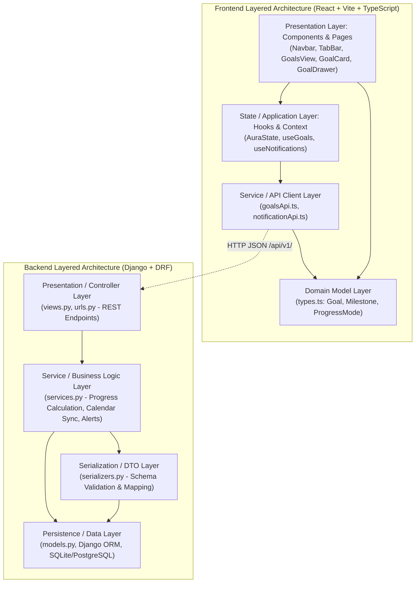

# Implementation Plan: Navigation Layout & Core Layered Architecture

**Branch**: `001-navigation-layout` | **Date**: 2026-09-03 | **Spec**: [spec.md](file:///d:/Sistemas/Proyectos/Gestor_tareas/specs/001-navigation-layout/spec.md)

**Input**: Feature specification from `/specs/001-navigation-layout/spec.md` and user architectural requirement: Layered Architecture (Arquitectura de Capas) & recommended technology stack.

## Summary

The Navigation Layout feature establishes the core visual shell and structural backbone of the "Aura" task manager application. It encompasses a top Navbar (branding, notifications with badge, user profile avatar), a TabBar (instant navigation across Calendario, Objetivos, Proyectos, Eventos), and the comprehensive functional foundation for the "Objetivos" section (quantifiable progress, weighted milestones, dual card/list views, slide-over drawer for CRUD, and calendar synchronization).

The implementation strictly enforces a **Layered Architecture (Arquitectura de Capas)** across both backend and frontend to ensure high maintainability, testability, separation of concerns, and ultra-fast UI responsiveness.

---

## Technical Context & Recommended Stack

### Backend Stack (Python / Django)
- **Language / Runtime**: Python 3.12+
- **Core Web Framework**: Django 6.0+ (Robust ORM, battle-tested security, migrations)
- **API Framework**: Django REST Framework (DRF 3.17+) (Strict serialization, validation DTOs, REST conventions)
- **Database / Persistence**: SQLite (Development / instant mocking via `db.sqlite3`), configured to seamlessly migrate to PostgreSQL for production
- **Caching Layer**: Redis with `django-redis` (Sub-millisecond query caching for notification badges and calendar summaries)
- **AI / NLP Engine**: OpenAI Python SDK with Pydantic Structured Outputs (For intelligent goal breakdown and natural language task assistance)
- **Testing**: pytest & pytest-django (Automated testing of service logic, models, and API views)

### Frontend Stack (React / TypeScript)
- **Library & Bundler**: React 18+ with Vite (Instant hot module replacement, sub-100ms DOM updates)
- **Language**: TypeScript 5.0+ (Strict type contracts matching DRF serializers)
- **Styling**: Tailwind CSS 3.4+ (Zero-runtime utility CSS, custom vibrant palette matching Aura's visual identity)
- **Iconography**: Lucide React / SVG Icons (Consistent, accessible icons for notifications, tabs, filters, and drawer)
- **State Management**: React Context + custom domain hooks (`AuraState.tsx`) with optimistic local updates
- **Client Networking**: Native `fetch` with typed API client wrapper (`src/services/`)

### Performance & Constraints
- **Performance Goals**: UI tab transitions in under 100ms (SC-001); accessible contrast ratio ≥ 4.5:1 (SC-003).
- **Architectural Constraint**: Strict Layered Architecture with unidirectional dependencies. No presentation code in models; no direct database access from views without service layer rules.

---

## Constitution Check

*GATE: Must pass before Phase 0 research. Re-check after Phase 1 design.*

1. **Colorido y Altamente Visual**: The active navigation tabs, notification badge counts, and brand elements MUST utilize vibrant, cohesive HSL-based palettes with high visual contrast. -> **PASS**
2. **Rendimiento Ultra Rápido**: Navigating tabs MUST perform locally in the UI in under 100ms using state management (React Context) and optimized rendering. Backend APIs MUST support caching. -> **PASS**
3. **Modularidad Estricta (Arquitectura de Capas)**: Clear boundaries between Presentation, Service/State, Serialization/Client, and Persistence/Domain layers across both backend and frontend. -> **PASS**

---

## Architectural Layering (Arquitectura de Capas)



### Detailed Layer Responsibilities

#### 1. Backend Layers (`backend/`)
- **Presentation / API Layer (`views.py`, `urls.py`)**:
  - Handles incoming HTTP requests, route dispatching, request authentication, and response status formatting.
  - Implements caching headers and Redis-backed response caching for read-heavy operations.
- **Service / Business Logic Layer (`services.py`)**:
  - Implements core business logic: hybrid progress calculation (manual slider vs milestone weighting), milestone validation, goal completion triggers, proactive notification alerts, and projection of goal deadlines onto the calendar.
- **Serialization / DTO Layer (`serializers.py`)**:
  - Validates payload structures, deserializes client data, and serializes ORM models into clean JSON schemas.
- **Persistence Layer (`models.py`)**:
  - Defines database schema for `UserProfile`, `Notification`, `ElementoAura`, `Goal`, and `GoalMilestone`, including foreign keys, indexes, and constraints.

#### 2. Frontend Layers (`src/`)
- **Presentation Layer (`src/components/`, `src/App.tsx`)**:
  - Presentational and container components: Navbar, TabBar, GoalsView, GoalCard, GoalTable, GoalDrawer, CalendarGrid.
  - Implements responsive layouts (mobile swipe, desktop grid) with Tailwind CSS.
- **State / Application Layer (`src/context/AuraState.tsx`)**:
  - Centralized application state management for active tab, notifications, goal filters, drawer visibility, and selected goal editing.
- **Service Layer (`src/services/`)**:
  - Typed HTTP API client isolating network requests, error transformations, and base URL configurations.
- **Domain Layer (`src/domain/types.ts`)**:
  - Pure TypeScript interfaces, enums (`ProgressMode`, `GoalStatus`, `ActiveTab`), and validation rules.

---

## Project Structure

### Documentation (this feature)

```text
specs/001-navigation-layout/
├── plan.md              # Implementation plan (this file)
├── research.md          # Technical research & stack decisions
├── data-model.md        # Entities, attributes, schemas (Backend & Frontend)
├── contracts/           # API contracts (OpenAPI/REST schemas)
│   └── api.md
├── quickstart.md        # Validation guide and test scenarios
└── tasks.md             # Execution task breakdown
```

### Source Code Mapping

```text
backend/
├── models.py            # Persistence: UserProfile, Notification, Goal, GoalMilestone
├── serializers.py       # Serialization: DTOs & validation schemas
├── services.py          # Business Logic: Progress calculator, calendar sync, alerts
├── views.py             # Presentation: REST API ViewSets & endpoints
├── urls.py              # URL routing
├── settings.py          # Django & Redis configuration
└── tests.py             # Unit and integration test suites

src/
├── domain/
│   └── types.ts         # Domain models & TypeScript interfaces
├── services/
│   └── api.ts           # Frontend API client service
├── context/
│   └── AuraState.tsx    # Application state & Context provider
├── components/
│   ├── Navbar.tsx       # Top header, branding, notifications badge, avatar menu
│   ├── TabBar.tsx       # Horizontal navigation bar (Calendario, Objetivos, Proyectos, Eventos)
│   ├── goals/
│   │   ├── GoalsView.tsx    # Container with dual view switcher & filters
│   │   ├── GoalCard.tsx     # Visual card with progress bar and category badge
│   │   ├── GoalTable.tsx    # Compact list view
│   │   └── GoalDrawer.tsx   # Slide-over panel for goal & milestone CRUD
│   ├── CalendarGrid.tsx     # Calendar view displaying synchronized goal deadlines
│   └── ElementoModal.tsx    # Creation/editing modal for calendar activities
├── App.tsx              # Application shell integration
└── index.css            # Tailwind directives and theme variables
```

---

## Proposed Changes by Component

### Backend (Django)

#### [MODIFY] [models.py](file:///d:/Sistemas/Proyectos/Gestor_tareas/backend/models.py)
- Expand models:
  - `UserProfile`: Avatar URL, user reference, theme preference.
  - `Notification`: User foreign key, title, message, is_read, created_at.
  - `Goal`: Title, description, deadline, category tag, color hex, progress mode (`MANUAL` or `MILESTONES`), progress percentage (0-100%), status (`ACTIVE`, `COMPLETED`, `PAUSED`).
  - `GoalMilestone`: Goal foreign key, title, is_completed, custom weight value, target date.

#### [MODIFY] [serializers.py](file:///d:/Sistemas/Proyectos/Gestor_tareas/backend/serializers.py)
- Serializers for `UserProfileSerializer`, `NotificationSerializer`.
- `GoalMilestoneSerializer` and nested `GoalSerializer` with validation for milestone weights and progress range (0-100).

#### [MODIFY] [services.py](file:///d:/Sistemas/Proyectos/Gestor_tareas/backend/services.py)
- `calculate_goal_progress(goal)`: Logic for calculating progress either from equal weights or custom milestone weights.
- `sync_goals_to_calendar(user)`: Derives calendar deadline markers from active goals and milestones.
- `check_approaching_deadlines(user)`: Evaluates goals/milestones due within 24-48h and generates notifications.

#### [MODIFY] [views.py](file:///d:/Sistemas/Proyectos/Gestor_tareas/backend/views.py)
- Endpoints for:
  - `GET /api/v1/profile/`
  - `GET /api/v1/notifications/`, `GET /api/v1/notifications/unread-count/`, `POST /api/v1/notifications/{id}/read/`
  - `GET/POST /api/v1/goals/`, `GET/PUT/DELETE /api/v1/goals/{id}/`
  - `POST /api/v1/goals/{id}/milestones/`
  - `GET /api/v1/calendar/events/` (including projected goal deadlines)

### Frontend (React + Vite + TypeScript)

#### [MODIFY] [types.ts](file:///d:/Sistemas/Proyectos/Gestor_tareas/src/domain/types.ts)
- Add domain types: `Goal`, `GoalMilestone`, `ProgressMode`, `GoalStatus`, `CategoryTag`, `UserProfile`, `Notification`.

#### [MODIFY] [AuraState.tsx](file:///d:/Sistemas/Proyectos/Gestor_tareas/src/context/AuraState.tsx)
- Expose state and handlers for active tab, unread notifications, goals collection, active view mode (`cards` vs `list`), active filter criteria, and drawer state (open/closed, editing goal).

#### [NEW] [GoalsView.tsx](file:///d:/Sistemas/Proyectos/Gestor_tareas/src/components/goals/GoalsView.tsx)
- Dual-view container rendering either `GoalCard` grid or `GoalTable` list, with filter chips and "Nuevo Objetivo" trigger button.

#### [NEW] [GoalDrawer.tsx](file:///d:/Sistemas/Proyectos/Gestor_tareas/src/components/goals/GoalDrawer.tsx)
- Slide-over panel from the right edge for creating and editing goals, toggling progress mode (manual slider vs milestones), managing milestone checklists, and assigning custom milestone weights.

#### [MODIFY] [App.tsx](file:///d:/Sistemas/Proyectos/Gestor_tareas/src/App.tsx)
- Integrate refreshed Navbar (with real dropdown toggles for notifications and profile), TabBar, and dynamic rendering of `GoalsView` when `tabActiva === 'OBJETIVOS'`.

---

## Complexity Tracking

| Violation | Why Needed | Simpler Alternative Rejected Because |
|-----------|------------|-------------------------------------|
| None | N/A | N/A |
