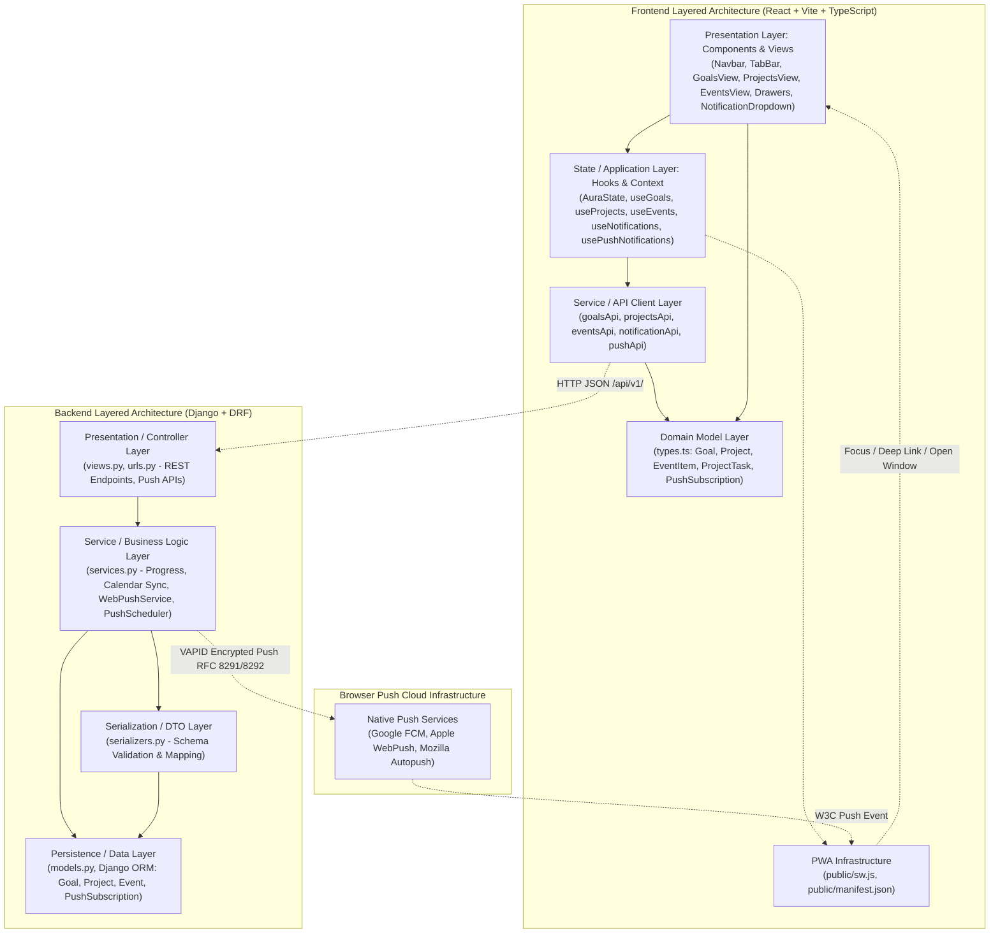

# Implementation Plan: Navigation Layout, Objetivos, Proyectos, Eventos, Web Push (PWA) & Auth Welcome Screen

**Branch**: `001-navigation-layout` | **Date**: 2026-09-23 | **Spec**: [spec.md](file:///d:/Sistemas/Proyectos/Gestor_tareas/specs/001-navigation-layout/spec.md)

**Input**: Feature specification from `/specs/001-navigation-layout/spec.md` including Navbar, TabBar, Objetivos, Proyectos (Hub, Workspace Kanban, Tasks, Subtasks), Eventos (Chronological Agenda), Native Web Push Notifications (PWA), and the newly clarified **Welcome & Authentication Screen (Inicio de Sesión y Registro con pantalla de bienvenida dividida en 2 partes)**.

## Summary

The Navigation Layout & Workspaces feature establishes the core visual shell and structural backbone of the "Aura" task manager application:
1. **Application Shell**: A persistent top Navbar (branding "Aura", notifications with badge counter, user profile avatar menu) and horizontal TabBar (instant navigation between Calendario, Objetivos, Proyectos, Eventos).
2. **Objetivos Section**: Quantifiable goal progress (0-100%), hybrid calculation (manual slider vs milestone weighting), dual card/list views, slide-over drawer for CRUD, and automatic calendar synchronization.
3. **Proyectos Section**:
   - **Projects Hub**: Visual grid of project cards with theme color, lifecycle status, calculated progress bar (0-100%), and optional link to a strategic Goal.
   - **Lifecycle Management**: Quick-filter pills (*"Activos"*, *"Completados"*, *"Archivados"*) with instant client-side text search.
   - **Dedicated Project Workspace**: Breadcrumb navigation into an interactive workspace featuring a 3-column Kanban board (*"Por hacer"*, *"En progreso"*, *"Completado"*) and toggleable compact task list.
   - **Tasks & Subtasks**: Tasks with color-coded priority levels (*Baja, Media, Alta*), deadline dates, and checkable subtasks.
   - **Automatic Progress Calculation**: Project completion percentage dynamically computed as `(completed tasks / total tasks) * 100`.
   - **Cross-Sectional Integration**: Project tasks with deadlines project directly onto the **Calendario** view styled with the project's color theme, and emit approaching deadline alerts.
   - **Slide-over Drawers**: Consistent right-edge drawers for detailed editing of projects and tasks without losing workspace context.
4. **Eventos Section**:
   - **Chronological Agenda**: Events organized into 4 dynamic time blocks (*"Hoy"*, *"Esta semana"*, *"Próximos"*, *"Pasados"*) with visual color-coded category cards and instant category filtering.
   - **Lifecycle State Management**: Explicit statuses (*"Programado"*, *"Completado"*, *"Cancelado"*) with one-click quick completion/cancellation actions.
   - **Slide-over Event Drawer**: Non-blocking right-edge drawer for configuring dates, times, locations or virtual meeting links, category themes, and reminder lead times.
   - **Unified Calendar Projection**: Full time-range projection into the **Calendario** tab and proactive approaching-event alerts on the Navbar notification bell.
5. **Native Web Push Notifications & PWA Architecture (Laptops & Mobiles)**:
   - **Standards-based VAPID Protocol**: Server-side payload encryption and delivery via `pywebpush` in Django directly to browser push servers (Google FCM, Apple WebPush, Mozilla Autopush) without third-party recurring fees.
   - **Multi-Device Support (1:N)**: A user can register concurrent subscriptions across laptops and smartphones (`PushSubscription`), with automatic pruning of dead endpoints (HTTP 410 Gone / 404 Not Found).
   - **Lightweight In-Process Background Scheduler**: Periodic evaluation of approaching event reminders and task deadlines in Django without requiring Redis/Celery queue dependencies.
   - **PWA & Mobile Installability**: Standalone web app manifest (`manifest.json`) fulfilling iOS 16.4+ Home Screen requirement and Android installability.
   - **Contextual Deep Linking & Window Reuse**: Service Worker (`sw.js`) intercepts notifications, detects and focuses existing app tabs, and routes straight to the notified event/task.
   - **User-Gesture UX**: Explicit activation toggle in the notification dropdown respecting Apple/Google strict user gesture constraints, with assistive onboarding guidance for iOS.
6. **Welcome & Authentication Screen (Inicio de Sesión y Registro en 2 partes)**:
   - **Split 2-Part Layout**: Left/First part featuring a vibrant hero visual banner with branding illustration and 2 inspirational phrases/quotes; Right/Second part featuring interactive authentication forms.
   - **Toggleable Auth Forms**: Seamless header tabs (*"Iniciar Sesión"* and *"Crear Cuenta"*) allowing instant switching without page reload.
   - **Frictionless Return Experience**: When a user already has an account created and active session, opening the application shows only the welcome section (hero illustration and 2 phrases) with a primary one-click entry button (*"Entrar a Aura"*) and secondary action to switch accounts or sign out.
   - **Session Lifecycle & Account Switching**: Signing out or choosing "Cambiar de cuenta" immediately clears the session and restores the full split screen with authentication tabs.
   - **Responsive Single-Column Stacking**: On mobile viewports (<768px), the layout automatically collapses from side-by-side columns into a single vertical stack, scaling the hero image and keeping input forms and buttons easily accessible.

The implementation strictly enforces a **Layered Architecture (Arquitectura de Capas)** across both backend and frontend to ensure high maintainability, testability, separation of concerns, and ultra-fast UI responsiveness.

---

## Technical Context & Recommended Stack

### Backend Stack (Python / Django)
- **Language / Runtime**: Python 3.12+
- **Core Web Framework**: Django 6.0+ (Robust ORM, battle-tested security, migrations)
- **API Framework**: Django REST Framework (DRF 3.17+) (Strict serialization, validation DTOs, REST conventions)
- **Database / Persistence**: SQLite (Development / instant mocking via `db.sqlite3`), configured to seamlessly migrate to PostgreSQL for production
- **Web Push Protocol**: `pywebpush` (2.0+) & `cryptography` (IETF RFC 8291 / RFC 8292 VAPID encryption)
- **Background Scheduler**: Lightweight in-process background worker (APScheduler / threading) evaluating approaching reminders every 1–5 minutes
- **Caching Layer**: Redis with `django-redis` (Sub-millisecond query caching for notification badges and calendar summaries)
- **AI / NLP Engine**: OpenAI Python SDK with Pydantic Structured Outputs (For intelligent goal breakdown and natural language task assistance)
- **Testing**: pytest & pytest-django (Automated testing of service logic, models, and API views)

### Frontend Stack (React / TypeScript)
- **Library & Bundler**: React 18+ with Vite (Instant hot module replacement, sub-100ms DOM updates)
- **Language**: TypeScript 5.0+ (Strict type contracts matching DRF serializers)
- **Styling**: Tailwind CSS 3.4+ (Zero-runtime utility CSS, custom vibrant palette matching Aura's visual identity)
- **Iconography**: Lucide React / SVG Icons (Consistent, accessible icons for notifications, tabs, filters, and drawer)
- **PWA & Service Worker**: Web App Manifest (`manifest.json` standalone mode) + Native Service Worker (`sw.js` handling `push` and `notificationclick`)
- **State Management**: React Context + custom domain hooks (`AuraState.tsx`, `usePushNotifications.ts`) with optimistic local updates
- **Client Networking**: Native `fetch` with typed API client wrapper (`src/services/`)

### Performance & Constraints
- **Performance Goals**: UI tab transitions in under 100ms (SC-001); accessible contrast ratio ≥ 4.5:1 (SC-003).
- **Architectural Constraint**: Strict Layered Architecture with unidirectional dependencies. No presentation code in models; no direct database access from views without service layer rules.

---

## Constitution Check

*GATE: Must pass before Phase 0 research. Re-check after Phase 1 design.*

1. **Colorido y Altamente Visual**: The active navigation tabs, notification badge counts, and brand elements MUST utilize vibrant, cohesive HSL-based palettes with high visual contrast. -> **PASS**
2. **Rendimiento Ultra Rápido**: Navigating tabs MUST perform locally in the UI in under 100ms using state management (React Context) and optimized rendering. Backend APIs MUST support caching. -> **PASS**
3. **Modularidad Estricta (Arquitectura de Capas)**: Clear boundaries between Presentation, Service/State, Serialization/Client, and Persistence/Domain layers across both backend and frontend. -> **PASS**

---

## Architectural Layering (Arquitectura de Capas)



### Detailed Layer Responsibilities

#### 1. Backend Layers (`backend/`)
- **Presentation / API Layer (`views.py`, `urls.py`)**:
  - Handles incoming HTTP requests, route dispatching, request authentication, and response status formatting.
  - Implements ViewSets and endpoints for Profiles, Notifications, Goals, Projects, ProjectTasks, EventItems, and Web Push Subscriptions (`VapidPublicKeyAPI`, `PushSubscribeAPI`, `PushUnsubscribeAPI`, `PushTestDispatchAPI`).
- **Service / Business Logic Layer (`services.py`)**:
  - Implements core business logic:
    - Goal progress calculation (manual vs milestone weighting).
    - Project progress calculation: `(completed tasks / total tasks) * 100`.
    - Unified calendar projection: combines Goal deadlines, Milestones, Project Tasks, and scheduled EventItems.
    - Proactive deadline and event alert evaluation.
    - **WebPushService**: Payload generation, VAPID signing, delivery via `pywebpush`, and automatic pruning/deletion of dead subscriptions upon HTTP 410 (Gone) or 404 (Not Found).
    - **PushScheduler**: In-process background worker evaluating approaching event reminders and task deadlines on periodic intervals (every 1–5 minutes).
- **Serialization / DTO Layer (`serializers.py`)**:
  - Validates payload structures, deserializes client data, and serializes ORM models into clean JSON schemas (`GoalSerializer`, `ProjectSerializer`, `ProjectTaskSerializer`, `TaskSubtaskSerializer`, `EventItemSerializer`, `PushSubscriptionSerializer`).
- **Persistence Layer (`models.py`)**:
  - Defines database schema for `UserProfile`, `Notification`, `ElementoAura`, `Goal`, `GoalMilestone`, `Project`, `ProjectTask`, `TaskSubtask`, `EventItem`, and `PushSubscription` (1:N relationship with User).

#### 2. Frontend Layers (`src/` & `public/`)
- **Presentation Layer (`src/components/`, `src/App.tsx`)**:
  - Presentational and container components:
    - Shell: `Navbar.tsx`, `TabBar.tsx`, `NotificationDropdown.tsx` (with explicit push toggle and iOS PWA guidance).
    - Goals: `GoalsView.tsx`, `GoalCard.tsx`, `GoalTable.tsx`, `GoalDrawer.tsx`.
    - Projects: `ProjectsView.tsx`, `ProjectsHub.tsx`, `ProjectCard.tsx`, `ProjectWorkspace.tsx`, `KanbanBoard.tsx`, `KanbanColumn.tsx`, `TaskCard.tsx`, `ProjectDrawer.tsx`, `TaskDrawer.tsx`.
    - Events: `EventsView.tsx`, `EventTimelineBlock.tsx`, `EventCard.tsx`, `EventDrawer.tsx`.
    - Calendar: `CalendarGrid.tsx`.
- **State / Application Layer (`src/context/AuraState.tsx`, `src/hooks/`)**:
  - Centralized application state management for active tab, notifications, goals, projects, events, filters, time-block classification, quick status transitions, and drawer visibility.
  - `usePushNotifications.ts`: Custom React hook encapsulating permission state, VAPID key exchange, Service Worker registration, and backend device subscription syncing.
- **Service Layer (`src/services/`)**:
  - Typed HTTP API client isolating network requests, error transformations, and base URL configurations (`api.ts`).
- **PWA & Service Worker Infrastructure (`public/`)**:
  - `public/manifest.json`: Web App Manifest with `display: "standalone"`, icons, and theme color for home screen installation on iOS and Android.
  - `public/sw.js`: Service Worker handling `push` events (displaying native alerts) and `notificationclick` (detecting and focusing existing tabs via `clients.matchAll` or opening target URLs).
- **Domain Layer (`src/domain/types.ts`)**:
  - Pure TypeScript interfaces, enums (`ProgressMode`, `GoalStatus`, `ProjectStatus`, `TaskStatus`, `TaskPriority`, `EventStatus`, `TimeBlock`, `ActiveTab`, `PushSubscriptionDTO`, `WebPushStatus`), and validation rules.

---

## Project Structure

### Documentation (this feature)

```text
specs/001-navigation-layout/
├── plan.md              # Implementation plan (this file)
├── research.md          # Technical research & stack decisions
├── data-model.md        # Entities, attributes, schemas (Backend & Frontend)
├── contracts/           # API contracts (OpenAPI/REST schemas)
│   └── api.md
├── quickstart.md        # Validation guide and test scenarios
└── tasks.md             # Execution task breakdown
```

### Source Code Mapping

```text
backend/
├── models.py            # Persistence: UserProfile, Notification, Goal, GoalMilestone, Project, ProjectTask, TaskSubtask, EventItem
├── serializers.py       # Serialization: DTOs & validation schemas for all entities including EventItem
├── services.py          # Business Logic: Progress calculators, calendar sync, alerts & event reminders
├── views.py             # Presentation: REST API ViewSets & endpoints (Goals, Projects, Tasks, Events)
├── urls.py              # URL routing (/api/v1/...)
├── settings.py          # Django & Redis configuration
└── tests.py             # Unit and integration test suites

src/
├── domain/
│   └── types.ts         # Domain models & TypeScript interfaces (Goals, Projects, Tasks, Events)
├── services/
│   └── api.ts           # Frontend API client service
├── context/
│   └── AuraState.tsx    # Application state & Context provider
├── components/
│   ├── Navbar.tsx       # Top header, branding, notifications badge, avatar menu
│   ├── TabBar.tsx       # Horizontal navigation bar (Calendario, Objetivos, Proyectos, Eventos)
│   ├── goals/
│   │   ├── GoalsView.tsx    # Container with dual view switcher & filters
│   │   ├── GoalCard.tsx     # Visual card with progress bar and category badge
│   │   ├── GoalTable.tsx    # Compact list view
│   │   └── GoalDrawer.tsx   # Slide-over panel for goal & milestone CRUD
│   ├── projects/
│   │   ├── ProjectsView.tsx      # Main container switching between Hub and Workspace
│   │   ├── ProjectsHub.tsx       # Hub grid of project cards with status pills & search
│   │   ├── ProjectCard.tsx       # Visual project card with progress bar & theme color
│   │   ├── ProjectWorkspace.tsx  # Workspace shell with breadcrumb and view switcher
│   │   ├── KanbanBoard.tsx       # 3-column Kanban board (Por hacer, En progreso, Completado)
│   │   ├── KanbanColumn.tsx      # Individual column with task cards and quick-add
│   │   ├── TaskCard.tsx          # Task card with priority pill, deadline, and checklist counter
│   │   ├── ProjectDrawer.tsx     # Slide-over drawer for creating/editing projects
│   │   └── TaskDrawer.tsx        # Slide-over drawer for editing task details & subtasks
│   ├── events/
│   │   ├── EventsView.tsx          # Main events view with time-block grouping & category filter pills
│   │   ├── EventTimelineBlock.tsx  # Section container for each time block (Hoy, Esta semana, Próximos, Pasados)
│   │   ├── EventCard.tsx           # Visual card with time span, location/link, category, and quick actions
│   │   └── EventDrawer.tsx         # Slide-over drawer for creating/editing event details
│   ├── CalendarGrid.tsx     # Calendar view displaying synchronized goal & task deadlines and events
│   └── ElementoModal.tsx    # Creation/editing modal for calendar activities
├── App.tsx              # Application shell integration
└── index.css            # Tailwind directives and theme variables
```

---

## Proposed Changes by Component

### Backend (Django)

#### [MODIFY] [models.py](file:///d:/Sistemas/Proyectos/Gestor_tareas/backend/models.py)
- Expand models:
  - `UserProfile`, `Notification`, `Goal`, `GoalMilestone`.
  - `Project`: Title, description, color_hex, status (`ACTIVE`, `COMPLETED`, `ARCHIVED`), progress_percentage, goal FK (nullable).
  - `ProjectTask`: Project FK, title, description, status (`TODO`, `IN_PROGRESS`, `DONE`), priority (`LOW`, `MEDIUM`, `HIGH`), deadline, order.
  - `TaskSubtask`: Task FK, title, is_completed, order.
  - `EventItem`: User FK, title, description, start_time, end_time, location, meeting_url, category, color_hex, status (`PROGRAMMED`, `COMPLETED`, `CANCELED`), reminder_minutes.
  - `PushSubscription`: User FK (1:N), endpoint, p256dh, auth, user_agent, timestamps, unique constraint `('user', 'endpoint')`.

#### [MODIFY] [serializers.py](file:///d:/Sistemas/Proyectos/Gestor_tareas/backend/serializers.py)
- Serializers:
  - `TaskSubtaskSerializer` & `ProjectTaskSerializer`.
  - `ProjectSerializer` with computed task metrics and progress validation.
  - `EventItemSerializer` with start/end time validation and computed time-block tags.
  - `GoalSerializer`, `NotificationSerializer`, `UserProfileSerializer`.
  - `PushSubscriptionSerializer` for validating endpoint and client cryptographic keys.
  - `UserRegisterSerializer` for validating username uniqueness, email format, and password confirmation matching.
  - `UserLoginSerializer` for validating username/email and password credentials.
  - `UserSessionSerializer` for returning authenticated session user details.

#### [MODIFY] [services.py](file:///d:/Sistemas/Proyectos/Gestor_tareas/backend/services.py)
- `calculate_goal_progress(goal)`
- `calculate_project_progress(project)`: Computes `(completed_tasks / total_tasks) * 100`.
- `sync_all_to_calendar(user)`: Derives calendar deadline markers and scheduled time spans from goals, milestones, project tasks, and event items.
- `check_approaching_deadlines(user)`: Evaluates approaching deadlines for goals and project tasks.
- `check_approaching_event_reminders(user)`: Generates real-time notifications for events approaching their scheduled start time within `reminder_minutes`.
- `send_web_push(user, title, message, url)`: Delivers encrypted push payload to all registered user devices via `pywebpush`, with automatic pruning of dead endpoints (HTTP 410/404).
- `start_notification_scheduler()`: Lightweight in-process background worker checking approaching deadlines and event reminders on periodic intervals.
- `authenticate_user(username_or_email, password)`: Flexible authentication helper supporting login via username or email address.

#### [MODIFY] [views.py](file:///d:/Sistemas/Proyectos/Gestor_tareas/backend/views.py)
- Endpoints for:
  - `GET/POST /api/v1/projects/`, `GET/PUT/DELETE /api/v1/projects/{id}/`
  - `GET/POST /api/v1/projects/{id}/tasks/`, `PUT/PATCH/DELETE /api/v1/tasks/{id}/`, `PATCH /api/v1/tasks/{id}/status/`
  - `PATCH /api/v1/subtasks/{id}/toggle/`
  - `GET/POST /api/v1/events/`, `GET/PUT/PATCH/DELETE /api/v1/events/{id}/`, `PATCH /api/v1/events/{id}/status/`
  - `GET /api/v1/calendar/events/` (including projected task deadlines and scheduled event slots)
  - `GET /api/v1/notifications/push/public-key/` (`VapidPublicKeyAPI`)
  - `POST /api/v1/notifications/push/subscribe/` (`PushSubscribeAPI`)
  - `POST /api/v1/notifications/push/unsubscribe/` (`PushUnsubscribeAPI`)
  - `POST /api/v1/notifications/push/test/` (`PushTestDispatchAPI`)
  - `POST /api/v1/auth/register/` (`RegisterAPI`: account creation with username, email, password confirmation)
  - `POST /api/v1/auth/login/` (`LoginAPI`: session establishment via username or email)
  - `POST /api/v1/auth/logout/` (`LogoutAPI`: session invalidation)
  - `GET /api/v1/auth/session/` (`SessionAPI`: check persistent session validity)

#### [MODIFY] [urls.py](file:///d:/Sistemas/Proyectos/Gestor_tareas/backend/urls.py)
- Register Web Push endpoints under `/api/v1/notifications/push/`.
- Register Authentication endpoints under `/api/v1/auth/`.

### Frontend (React + Vite + TypeScript)

#### [MODIFY] [types.ts](file:///d:/Sistemas/Proyectos/Gestor_tareas/src/domain/types.ts)
- Add domain types: `Project`, `ProjectTask`, `TaskSubtask`, `ProjectStatus`, `TaskStatus`, `TaskPriority`, `ProjectFilterCriteria`.
- Add event domain types: `EventItem`, `EventStatus`, `TimeBlock`, `EventFilterCriteria`.
- Add Web Push domain types: `PushSubscriptionKeys`, `PushSubscriptionDTO`, `WebPushStatus`.
- Add Auth domain types: `AuthMode` (*'LOGIN'* | *'REGISTER'*), `AuthState` (*user, isAuthenticated, hasExistingAccount, isWelcomeOnly*), `LoginCredentials`, `RegisterData`.

#### [MODIFY] [AuraState.tsx](file:///d:/Sistemas/Proyectos/Gestor_tareas/src/context/AuraState.tsx)
- Expose state and handlers for projects collection, active project workspace, project filtering, task creation, task status movement (Kanban), subtask toggling, and project/task drawer toggles.
- Expose state and handlers for events collection, time-block classification ("Hoy", "Esta semana", "Próximos", "Pasados"), category filters, quick status toggling (Completado/Cancelado), and event drawer visibility.
- Expose state and handlers for authentication: `currentUser`, `isAuthenticated`, `isWelcomeOnly`, `login(creds)`, `register(data)`, `enterApp()`, `logout()`, `switchAccount()`.

#### [MODIFY] [api.ts](file:///d:/Sistemas/Proyectos/Gestor_tareas/src/services/api.ts)
- Add API client methods for Projects, Tasks, Subtasks, and Events (`getEvents`, `createEvent`, `updateEvent`, `updateEventStatus`, `deleteEvent`).
- Add Web Push client methods: `getVapidPublicKey()`, `subscribePush(sub)`, `unsubscribePush(endpoint)`, `testPushNotification(payload)`.
- Add Auth client methods: `login(creds)`, `register(data)`, `logout()`, `getSession()`.

#### [NEW] [usePushNotifications.ts](file:///d:/Sistemas/Proyectos/Gestor_tareas/src/hooks/usePushNotifications.ts)
- React hook encapsulating permission checking, VAPID key conversion (`urlBase64ToUint8Array`), Service Worker registration, and backend device subscription synchronization.

#### [NEW] [manifest.json](file:///d:/Sistemas/Proyectos/Gestor_tareas/public/manifest.json)
- Web App Manifest specifying `display: "standalone"`, branding icons, `name: "Aura - Gestor de Tareas"`, and `theme_color: "#6366F1"` to satisfy iOS 16.4+ Home Screen requirement and Android installation.

#### [NEW] [sw.js](file:///d:/Sistemas/Proyectos/Gestor_tareas/public/sw.js)
- Native Service Worker listening to:
  - `push`: Parses payload (`title`, `message`, `url`, `icon`) and executes `self.registration.showNotification(...)`.
  - `notificationclick`: Deep links to the contextual item by querying open windows (`clients.matchAll`), focusing existing tabs (`client.focus()`), or opening a new browser window.

#### [MODIFY] [NotificationDropdown.tsx](file:///d:/Sistemas/Proyectos/Gestor_tareas/src/components/NotificationDropdown.tsx)
- Add explicit user-gesture push activation button/toggle ("Activar notificaciones en esta laptop/celular") and contextual guidance for iOS users outside standalone PWA mode.

#### [MODIFY] [index.html](file:///d:/Sistemas/Proyectos/Gestor_tareas/index.html)
- Add `<link rel="manifest" href="/manifest.json">` and register Service Worker on load.

#### [NEW] [AuthView.tsx](file:///d:/Sistemas/Proyectos/Gestor_tareas/src/components/auth/AuthView.tsx)
- Top-level split-screen container rendering the left hero banner and the right interactive block (either `AuthForms` for new visitors/login or `WelcomeView` for returning users with active session).
- Automatically adapts to single-column vertical stack on mobile screens (<768px).

#### [NEW] [HeroBanner.tsx](file:///d:/Sistemas/Proyectos/Gestor_tareas/src/components/auth/HeroBanner.tsx)
- First/Left part of the split screen: renders Aura visual illustration, branding logo badge, and the two inspirational quotes/phrases (*"Organiza tu día con claridad y propósito."* y *"Transforma cada meta en un logro tangible."* as placeholders until final assets).

#### [NEW] [AuthForms.tsx](file:///d:/Sistemas/Proyectos/Gestor_tareas/src/components/auth/AuthForms.tsx)
- Second/Right part for unauthenticated users: toggleable tabs (*"Iniciar Sesión"* / *"Crear Cuenta"*), client-side input validation, error alerts, and animated transition between forms.

#### [NEW] [WelcomeView.tsx](file:///d:/Sistemas/Proyectos/Gestor_tareas/src/components/auth/WelcomeView.tsx)
- Welcome panel for returning users: personalized greeting with user avatar, primary action button (*"Entrar a Aura"* / *"Continuar"*), and secondary link (*"Cambiar de cuenta"* / *"Cerrar sesión"*).

#### [NEW] [ProjectsView.tsx](file:///d:/Sistemas/Proyectos/Gestor_tareas/src/components/projects/ProjectsView.tsx)
- Top-level container toggling between `ProjectsHub` and `ProjectWorkspace`.

#### [NEW] [ProjectsHub.tsx](file:///d:/Sistemas/Proyectos/Gestor_tareas/src/components/projects/ProjectsHub.tsx)
- Projects grid with search bar, status pills (*Activos, Completados, Archivados*), and "+ Nuevo Proyecto" button.

#### [NEW] [ProjectCard.tsx](file:///d:/Sistemas/Proyectos/Gestor_tareas/src/components/projects/ProjectCard.tsx)
- Visual project card displaying title, color theme, progress bar, task completion counter, and strategic goal pill.

#### [NEW] [ProjectWorkspace.tsx](file:///d:/Sistemas/Proyectos/Gestor_tareas/src/components/projects/ProjectWorkspace.tsx)
- Dedicated workspace with breadcrumb back-link, project progress header, and Kanban / List view switcher.

#### [NEW] [KanbanBoard.tsx](file:///d:/Sistemas/Proyectos/Gestor_tareas/src/components/projects/KanbanBoard.tsx)
- 3-column board (*Por hacer, En progreso, Completado*) supporting card dragging and quick-add.

#### [NEW] [KanbanColumn.tsx](file:///d:/Sistemas/Proyectos/Gestor_tareas/src/components/projects/KanbanColumn.tsx)
- Individual column with counter badge, task cards, and inline task creator.

#### [NEW] [TaskCard.tsx](file:///d:/Sistemas/Proyectos/Gestor_tareas/src/components/projects/TaskCard.tsx)
- Interactive task card with priority tag, deadline marker, checklist completion indicator, and quick-move menu.

#### [NEW] [ProjectDrawer.tsx](file:///d:/Sistemas/Proyectos/Gestor_tareas/src/components/projects/ProjectDrawer.tsx)
- Slide-over drawer for creating/editing project details, color selection, and Goal linkage.

#### [NEW] [TaskDrawer.tsx](file:///d:/Sistemas/Proyectos/Gestor_tareas/src/components/projects/TaskDrawer.tsx)
- Slide-over drawer for editing task title, description, priority, deadline, and checklist subtasks.

#### [NEW] [EventsView.tsx](file:///d:/Sistemas/Proyectos/Gestor_tareas/src/components/events/EventsView.tsx)
- Top-level container for the Eventos tab featuring header actions, "+ Nuevo Evento" trigger, category filter pills, and grouped chronological timeline blocks.

#### [NEW] [EventTimelineBlock.tsx](file:///d:/Sistemas/Proyectos/Gestor_tareas/src/components/events/EventTimelineBlock.tsx)
- Section block rendering events belonging to a specific temporal grouping (*Hoy, Esta semana, Próximos, Pasados*) with empty state handling.

#### [NEW] [EventCard.tsx](file:///d:/Sistemas/Proyectos/Gestor_tareas/src/components/events/EventCard.tsx)
- Interactive event card displaying category color badge, time span, location or meeting link button, description snippet, and quick-actions (*Completar, Cancelar, Editar*).

#### [NEW] [EventDrawer.tsx](file:///d:/Sistemas/Proyectos/Gestor_tareas/src/components/events/EventDrawer.tsx)
- Slide-over drawer panel for creating and editing event details, time pickers, category theme, virtual links, and reminder lead times.

#### [MODIFY] [App.tsx](file:///d:/Sistemas/Proyectos/Gestor_tareas/src/App.tsx)
- If user is not authenticated or in welcome screen mode, render `AuthView`.
- Once authenticated and in app mode, render main application shell (`Navbar`, `TabBar`, and active section view: `GoalsView`, `ProjectsView`, `EventsView`, `CalendarGrid`).

---

## Complexity Tracking

| Violation | Why Needed | Simpler Alternative Rejected Because |
|-----------|------------|-------------------------------------|
| None | N/A | N/A |
