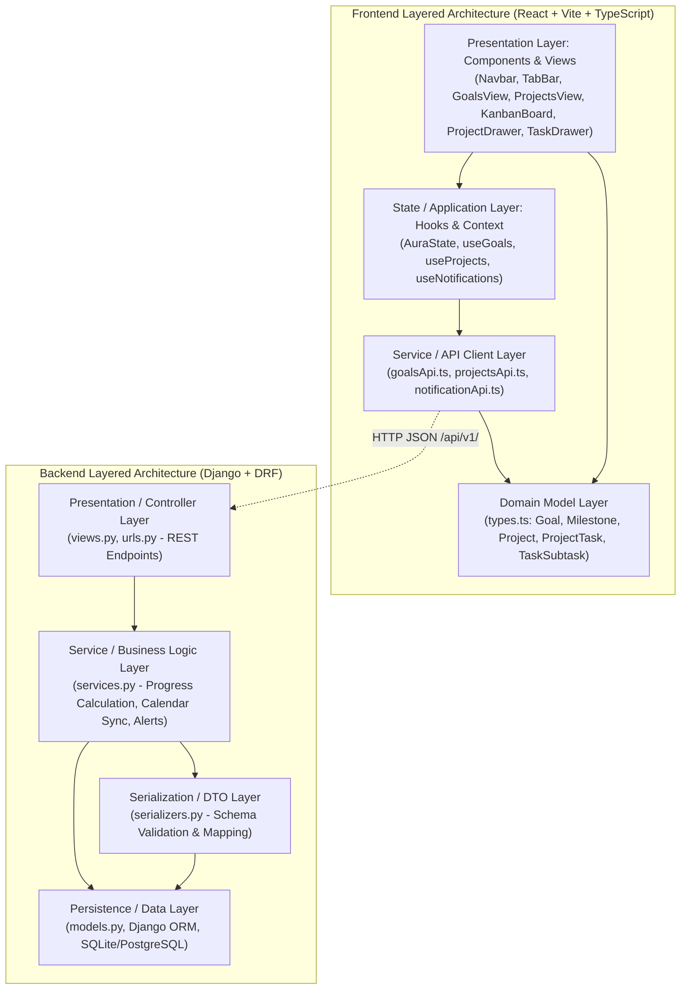

# Implementation Plan: Navigation Layout, Objetivos & Proyectos Management

**Branch**: `001-navigation-layout` | **Date**: 2026-09-07 | **Spec**: [spec.md](file:///d:/Sistemas/Proyectos/Gestor_tareas/specs/001-navigation-layout/spec.md)

**Input**: Feature specification from `/specs/001-navigation-layout/spec.md` including Navbar, TabBar, Objetivos, and the newly clarified Proyectos section (Hub, Workspace Kanban 3-state, List view, Tasks, Subtasks, Project progress calculation, Goal linkage, Calendar deadline projection, Slide-over drawer, filter pills and instant search).

## Summary

The Navigation Layout & Workspaces feature establishes the core visual shell and structural backbone of the "Aura" task manager application:
1. **Application Shell**: A persistent top Navbar (branding "Aura", notifications with badge counter, user profile avatar menu) and horizontal TabBar (instant navigation between Calendario, Objetivos, Proyectos, Eventos).
2. **Objetivos Section**: Quantifiable goal progress (0-100%), hybrid calculation (manual slider vs milestone weighting), dual card/list views, slide-over drawer for CRUD, and automatic calendar synchronization.
3. **Proyectos Section**:
   - **Projects Hub**: Visual grid of project cards with theme color, lifecycle status, calculated progress bar (0-100%), and optional link to a strategic Goal.
   - **Lifecycle Management**: Quick-filter pills (*"Activos"*, *"Completados"*, *"Archivados"*) with instant client-side text search.
   - **Dedicated Project Workspace**: Breadcrumb navigation into an interactive workspace featuring a 3-column Kanban board (*"Por hacer"*, *"En progreso"*, *"Completado"*) and toggleable compact task list.
   - **Tasks & Subtasks**: Tasks with color-coded priority levels (*Baja, Media, Alta*), deadline dates, and checkable subtasks.
   - **Automatic Progress Calculation**: Project completion percentage dynamically computed as `(completed tasks / total tasks) * 100`.
   - **Cross-Sectional Integration**: Project tasks with deadlines project directly onto the **Calendario** view styled with the project's color theme, and emit approaching deadline alerts.
   - **Slide-over Drawers**: Consistent right-edge drawers for detailed editing of projects and tasks without losing workspace context.

The implementation strictly enforces a **Layered Architecture (Arquitectura de Capas)** across both backend and frontend to ensure high maintainability, testability, separation of concerns, and ultra-fast UI responsiveness.

---

## Technical Context & Recommended Stack

### Backend Stack (Python / Django)
- **Language / Runtime**: Python 3.12+
- **Core Web Framework**: Django 6.0+ (Robust ORM, battle-tested security, migrations)
- **API Framework**: Django REST Framework (DRF 3.17+) (Strict serialization, validation DTOs, REST conventions)
- **Database / Persistence**: SQLite (Development / instant mocking via `db.sqlite3`), configured to seamlessly migrate to PostgreSQL for production
- **Caching Layer**: Redis with `django-redis` (Sub-millisecond query caching for notification badges and calendar summaries)
- **AI / NLP Engine**: OpenAI Python SDK with Pydantic Structured Outputs (For intelligent goal breakdown and natural language task assistance)
- **Testing**: pytest & pytest-django (Automated testing of service logic, models, and API views)

### Frontend Stack (React / TypeScript)
- **Library & Bundler**: React 18+ with Vite (Instant hot module replacement, sub-100ms DOM updates)
- **Language**: TypeScript 5.0+ (Strict type contracts matching DRF serializers)
- **Styling**: Tailwind CSS 3.4+ (Zero-runtime utility CSS, custom vibrant palette matching Aura's visual identity)
- **Iconography**: Lucide React / SVG Icons (Consistent, accessible icons for notifications, tabs, filters, and drawer)
- **State Management**: React Context + custom domain hooks (`AuraState.tsx`) with optimistic local updates
- **Client Networking**: Native `fetch` with typed API client wrapper (`src/services/`)

### Performance & Constraints
- **Performance Goals**: UI tab transitions in under 100ms (SC-001); accessible contrast ratio ≥ 4.5:1 (SC-003).
- **Architectural Constraint**: Strict Layered Architecture with unidirectional dependencies. No presentation code in models; no direct database access from views without service layer rules.

---

## Constitution Check

*GATE: Must pass before Phase 0 research. Re-check after Phase 1 design.*

1. **Colorido y Altamente Visual**: The active navigation tabs, notification badge counts, and brand elements MUST utilize vibrant, cohesive HSL-based palettes with high visual contrast. -> **PASS**
2. **Rendimiento Ultra Rápido**: Navigating tabs MUST perform locally in the UI in under 100ms using state management (React Context) and optimized rendering. Backend APIs MUST support caching. -> **PASS**
3. **Modularidad Estricta (Arquitectura de Capas)**: Clear boundaries between Presentation, Service/State, Serialization/Client, and Persistence/Domain layers across both backend and frontend. -> **PASS**

---

## Architectural Layering (Arquitectura de Capas)



### Detailed Layer Responsibilities

#### 1. Backend Layers (`backend/`)
- **Presentation / API Layer (`views.py`, `urls.py`)**:
  - Handles incoming HTTP requests, route dispatching, request authentication, and response status formatting.
  - Implements ViewSets for Profiles, Notifications, Goals, Projects, and ProjectTasks.
- **Service / Business Logic Layer (`services.py`)**:
  - Implements core business logic:
    - Goal progress calculation (manual vs milestone weighting).
    - Project progress calculation: `(completed tasks / total tasks) * 100`.
    - Unified calendar projection: combines Goal deadlines, Milestones, and dated Project Tasks.
    - Proactive deadline alert evaluation.
- **Serialization / DTO Layer (`serializers.py`)**:
  - Validates payload structures, deserializes client data, and serializes ORM models into clean JSON schemas (`GoalSerializer`, `ProjectSerializer`, `ProjectTaskSerializer`, `TaskSubtaskSerializer`).
- **Persistence Layer (`models.py`)**:
  - Defines database schema for `UserProfile`, `Notification`, `ElementoAura`, `Goal`, `GoalMilestone`, `Project`, `ProjectTask`, and `TaskSubtask`.

#### 2. Frontend Layers (`src/`)
- **Presentation Layer (`src/components/`, `src/App.tsx`)**:
  - Presentational and container components:
    - Shell: `Navbar.tsx`, `TabBar.tsx`.
    - Goals: `GoalsView.tsx`, `GoalCard.tsx`, `GoalTable.tsx`, `GoalDrawer.tsx`.
    - Projects: `ProjectsView.tsx`, `ProjectsHub.tsx`, `ProjectCard.tsx`, `ProjectWorkspace.tsx`, `KanbanBoard.tsx`, `KanbanColumn.tsx`, `TaskCard.tsx`, `ProjectDrawer.tsx`, `TaskDrawer.tsx`.
    - Calendar: `CalendarGrid.tsx`.
- **State / Application Layer (`src/context/AuraState.tsx`)**:
  - Centralized application state management for active tab, notifications, goals, projects, active project workspace, task dragging/status updates, filters, and drawer visibility.
- **Service Layer (`src/services/`)**:
  - Typed HTTP API client isolating network requests, error transformations, and base URL configurations (`api.ts`).
- **Domain Layer (`src/domain/types.ts`)**:
  - Pure TypeScript interfaces, enums (`ProgressMode`, `GoalStatus`, `ProjectStatus`, `TaskStatus`, `TaskPriority`, `ActiveTab`), and validation rules.

---

## Project Structure

### Documentation (this feature)

```text
specs/001-navigation-layout/
├── plan.md              # Implementation plan (this file)
├── research.md          # Technical research & stack decisions
├── data-model.md        # Entities, attributes, schemas (Backend & Frontend)
├── contracts/           # API contracts (OpenAPI/REST schemas)
│   └── api.md
├── quickstart.md        # Validation guide and test scenarios
└── tasks.md             # Execution task breakdown
```

### Source Code Mapping

```text
backend/
├── models.py            # Persistence: UserProfile, Notification, Goal, GoalMilestone, Project, ProjectTask, TaskSubtask
├── serializers.py       # Serialization: DTOs & validation schemas for all entities
├── services.py          # Business Logic: Progress calculators, calendar sync, alerts
├── views.py             # Presentation: REST API ViewSets & endpoints
├── urls.py              # URL routing (/api/v1/...)
├── settings.py          # Django & Redis configuration
└── tests.py             # Unit and integration test suites

src/
├── domain/
│   └── types.ts         # Domain models & TypeScript interfaces
├── services/
│   └── api.ts           # Frontend API client service
├── context/
│   └── AuraState.tsx    # Application state & Context provider
├── components/
│   ├── Navbar.tsx       # Top header, branding, notifications badge, avatar menu
│   ├── TabBar.tsx       # Horizontal navigation bar (Calendario, Objetivos, Proyectos, Eventos)
│   ├── goals/
│   │   ├── GoalsView.tsx    # Container with dual view switcher & filters
│   │   ├── GoalCard.tsx     # Visual card with progress bar and category badge
│   │   ├── GoalTable.tsx    # Compact list view
│   │   └── GoalDrawer.tsx   # Slide-over panel for goal & milestone CRUD
│   ├── projects/
│   │   ├── ProjectsView.tsx      # Main container switching between Hub and Workspace
│   │   ├── ProjectsHub.tsx       # Hub grid of project cards with status pills & search
│   │   ├── ProjectCard.tsx       # Visual project card with progress bar & theme color
│   │   ├── ProjectWorkspace.tsx  # Workspace shell with breadcrumb and view switcher
│   │   ├── KanbanBoard.tsx       # 3-column Kanban board (Por hacer, En progreso, Completado)
│   │   ├── KanbanColumn.tsx      # Individual column with task cards and quick-add
│   │   ├── TaskCard.tsx          # Task card with priority pill, deadline, and checklist counter
│   │   ├── ProjectDrawer.tsx     # Slide-over drawer for creating/editing projects
│   │   └── TaskDrawer.tsx        # Slide-over drawer for editing task details & subtasks
│   ├── CalendarGrid.tsx     # Calendar view displaying synchronized goal & task deadlines
│   └── ElementoModal.tsx    # Creation/editing modal for calendar activities
├── App.tsx              # Application shell integration
└── index.css            # Tailwind directives and theme variables
```

---

## Proposed Changes by Component

### Backend (Django)

#### [MODIFY] [models.py](file:///d:/Sistemas/Proyectos/Gestor_tareas/backend/models.py)
- Expand models:
  - `UserProfile`, `Notification`, `Goal`, `GoalMilestone`.
  - `Project`: Title, description, color_hex, status (`ACTIVE`, `COMPLETED`, `ARCHIVED`), progress_percentage, goal FK (nullable).
  - `ProjectTask`: Project FK, title, description, status (`TODO`, `IN_PROGRESS`, `DONE`), priority (`LOW`, `MEDIUM`, `HIGH`), deadline, order.
  - `TaskSubtask`: Task FK, title, is_completed, order.

#### [MODIFY] [serializers.py](file:///d:/Sistemas/Proyectos/Gestor_tareas/backend/serializers.py)
- Serializers:
  - `TaskSubtaskSerializer` & `ProjectTaskSerializer`.
  - `ProjectSerializer` with computed task metrics and progress validation.
  - `GoalSerializer`, `NotificationSerializer`, `UserProfileSerializer`.

#### [MODIFY] [services.py](file:///d:/Sistemas/Proyectos/Gestor_tareas/backend/services.py)
- `calculate_goal_progress(goal)`
- `calculate_project_progress(project)`: Computes `(completed_tasks / total_tasks) * 100`.
- `sync_all_to_calendar(user)`: Derives calendar deadline markers from active goals, milestones, and project tasks.
- `check_approaching_deadlines(user)`: Evaluates approaching deadlines for goals and project tasks.

#### [MODIFY] [views.py](file:///d:/Sistemas/Proyectos/Gestor_tareas/backend/views.py)
- Endpoints for:
  - `GET/POST /api/v1/projects/`, `GET/PUT/DELETE /api/v1/projects/{id}/`
  - `GET/POST /api/v1/projects/{id}/tasks/`, `PUT/PATCH/DELETE /api/v1/tasks/{id}/`, `PATCH /api/v1/tasks/{id}/status/`
  - `PATCH /api/v1/subtasks/{id}/toggle/`
  - `GET /api/v1/calendar/events/` (including projected task deadlines)

### Frontend (React + Vite + TypeScript)

#### [MODIFY] [types.ts](file:///d:/Sistemas/Proyectos/Gestor_tareas/src/domain/types.ts)
- Add domain types: `Project`, `ProjectTask`, `TaskSubtask`, `ProjectStatus`, `TaskStatus`, `TaskPriority`, `ProjectFilterCriteria`.

#### [MODIFY] [AuraState.tsx](file:///d:/Sistemas/Proyectos/Gestor_tareas/src/context/AuraState.tsx)
- Expose state and handlers for projects collection, active project workspace, project filtering, task creation, task status movement (Kanban), subtask toggling, and project/task drawer toggles.

#### [MODIFY] [api.ts](file:///d:/Sistemas/Proyectos/Gestor_tareas/src/services/api.ts)
- Add API client methods for Projects, Tasks, and Subtasks.

#### [NEW] [ProjectsView.tsx](file:///d:/Sistemas/Proyectos/Gestor_tareas/src/components/projects/ProjectsView.tsx)
- Top-level container toggling between `ProjectsHub` and `ProjectWorkspace`.

#### [NEW] [ProjectsHub.tsx](file:///d:/Sistemas/Proyectos/Gestor_tareas/src/components/projects/ProjectsHub.tsx)
- Projects grid with search bar, status pills (*Activos, Completados, Archivados*), and "+ Nuevo Proyecto" button.

#### [NEW] [ProjectCard.tsx](file:///d:/Sistemas/Proyectos/Gestor_tareas/src/components/projects/ProjectCard.tsx)
- Visual project card displaying title, color theme, progress bar, task completion counter, and strategic goal pill.

#### [NEW] [ProjectWorkspace.tsx](file:///d:/Sistemas/Proyectos/Gestor_tareas/src/components/projects/ProjectWorkspace.tsx)
- Dedicated workspace with breadcrumb back-link, project progress header, and Kanban / List view switcher.

#### [NEW] [KanbanBoard.tsx](file:///d:/Sistemas/Proyectos/Gestor_tareas/src/components/projects/KanbanBoard.tsx)
- 3-column board (*Por hacer, En progreso, Completado*) supporting card dragging and quick-add.

#### [NEW] [KanbanColumn.tsx](file:///d:/Sistemas/Proyectos/Gestor_tareas/src/components/projects/KanbanColumn.tsx)
- Individual column with counter badge, task cards, and inline task creator.

#### [NEW] [TaskCard.tsx](file:///d:/Sistemas/Proyectos/Gestor_tareas/src/components/projects/TaskCard.tsx)
- Interactive task card with priority tag, deadline marker, checklist completion indicator, and quick-move menu.

#### [NEW] [ProjectDrawer.tsx](file:///d:/Sistemas/Proyectos/Gestor_tareas/src/components/projects/ProjectDrawer.tsx)
- Slide-over drawer for creating/editing project details, color selection, and Goal linkage.

#### [NEW] [TaskDrawer.tsx](file:///d:/Sistemas/Proyectos/Gestor_tareas/src/components/projects/TaskDrawer.tsx)
- Slide-over drawer for editing task title, description, priority, deadline, and checklist subtasks.

#### [MODIFY] [App.tsx](file:///d:/Sistemas/Proyectos/Gestor_tareas/src/App.tsx)
- Render `ProjectsView` when `tabActiva === 'PROYECTOS'`.

---

## Complexity Tracking

| Violation | Why Needed | Simpler Alternative Rejected Because |
|-----------|------------|-------------------------------------|
| None | N/A | N/A |
