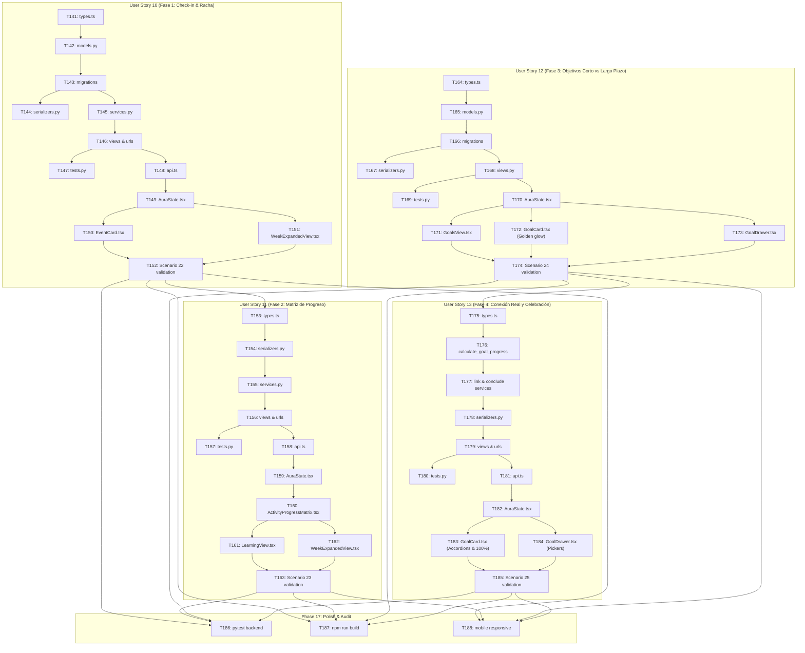

# Tasks: Navigation Layout, Objetivos, Proyectos, Eventos, Web Push, Auth, Aprendizaje & Fases 1 a 4

**Input**: Design documents from `/specs/001-navigation-layout/` (`spec.md`, `plan.md`, `research.md`, `data-model.md`, `contracts/api.md`, `quickstart.md`)

**Prerequisites**: `plan.md`, `spec.md`, `data-model.md`, `contracts/api.md`, `quickstart.md`

**Organization**: Tasks are grouped by user story to enable independent implementation and testing of each story, strictly adhering to the **Layered Architecture (Arquitectura de Capas)**.

## Format: `[ID] [P?] [Story] Description`

- **[P]**: Can run in parallel (different files, no dependencies)
- **[Story]**: Which user story this task belongs to (e.g., [US1], [US2], [US3])
- Exact file paths are specified for every task

## Path Conventions
- **Backend (Django)**: `backend/`
- **Frontend (React)**: `src/`

---

## Phase 1: Setup (Shared Infrastructure)

**Purpose**: Project initialization and basic dependencies.

- [X] T001 Configure backend settings, CORS, and REST framework in backend/settings.py
- [X] T002 [P] Configure Vite dev server proxy for /api/v1/ backend communication in vite.config.ts

---

## Phase 2: Foundational (Blocking Prerequisites - Models, Services & State)

**Purpose**: Core data persistence, service layer calculation logic, and application state that MUST be complete before user stories can be implemented.

**⚠️ CRITICAL**: All user story implementations depend on this foundational phase.

- [X] T003 [P] Create domain models and TypeScript interfaces for Goal, GoalMilestone, NotificationItem, UserProfile, ProgressMode, and GoalStatus in src/domain/types.ts
- [X] T004 [P] Implement database models UserProfile, Notification, Goal, and GoalMilestone in backend/models.py
- [X] T005 [P] Create DRF serializers for UserProfile, Notification, GoalMilestone, and Goal in backend/serializers.py
- [X] T006 Implement domain service functions for hybrid milestone progress calculation and calendar deadline synchronization in backend/services.py
- [X] T007 Apply database migrations for new models using makemigrations and migrate in backend/
- [X] T008 [P] Implement typed frontend HTTP client for backend REST API communication in src/services/api.ts
- [X] T009 Extend application state context with active tab persistence, goals state, filters, notifications, and drawer visibility in src/context/AuraState.tsx

**Checkpoint**: Foundation ready - user story implementation can now proceed.

---

## Phase 3: User Story 1 - Header Navigation Bar (Navbar) (Priority: P1)

**Goal**: Deliver the persistent top header showing colorful "Aura" branding, notification icon with dynamic unread badge count, and user avatar.

**Independent Test**: Load the application on any route; verify the "Aura" logo is rendered on the left with vibrant styling, and the notification bell (with unread numeric badge) and user profile avatar render on the right.

- [X] T010 [P] [US1] Implement REST API endpoints for user profile and unread notifications count in backend/views.py and backend/urls.py
- [X] T011 [P] [US1] Create unit tests for user profile and unread notifications count endpoints in backend/tests.py
- [X] T012 [US1] Build Navbar component with branding logo, notification button badge, and user avatar in src/components/Navbar.tsx
- [X] T013 [US1] Integrate Navbar into the main application layout in src/App.tsx

**Checkpoint**: User Story 1 is functional and verifiable independently.

---

## Phase 4: User Story 2 - Section Switching TabBar & Objetivos Section (Priority: P1) 🎯 MVP

**Goal**: Deliver instant horizontal tab switching (<100ms) with local persistence, plus the complete Objetivos section featuring dual card/list views, filter chips, right slide-over drawer for goal/milestone CRUD with weighted progress calculation, and calendar synchronization.

**Independent Test**: Switch between tabs and verify transitions are instant (<100ms) and persisted across page refresh. Click "Objetivos": verify dual view (cards vs list), filter chips by status and category, open the slide-over drawer to create/edit goals with milestone weights, verify automatic progress calculation, and verify goal deadlines project onto the "Calendario" tab.

- [X] T014 [P] [US2] Implement REST API endpoints for Goals CRUD and milestone toggle in backend/views.py and backend/urls.py
- [X] T015 [P] [US2] Create unit tests for goal creation, weighted milestone progress calculation, and calendar sync in backend/tests.py
- [X] T016 [P] [US2] Create TabBar component supporting dynamic navigation and active tab highlighting in src/components/TabBar.tsx
- [X] T017 [P] [US2] Build GoalCard component showing category theme badge, progress bar (0-100%), deadline, and expandable milestone list in src/components/goals/GoalCard.tsx
- [X] T018 [P] [US2] Build GoalTable component for compact list view with status indicators and progress bars in src/components/goals/GoalTable.tsx
- [X] T019 [US2] Build GoalDrawer slide-over panel from the right edge for creating and editing goals, switching progress mode, and configuring milestone weights in src/components/goals/GoalDrawer.tsx
- [X] T020 [US2] Build GoalsView container component with view switcher (Cards vs List), status/category filter chips, and drawer integration in src/components/goals/GoalsView.tsx
- [X] T021 [US2] Update CalendarGrid to display synchronized goal and milestone deadlines as colored calendar event markers in src/components/CalendarGrid.tsx
- [X] T022 [US2] Wire TabBar and dynamic rendering of GoalsView and CalendarGrid in src/App.tsx

**Checkpoint**: User Stories 1 and 2 are fully integrated and provide the complete core MVP experience.

---

## Phase 5: User Story 3 - Quick Action Dropdowns (Priority: P2)

**Goal**: Provide interactive dropdown menus when clicking the notification icon and user avatar, displaying recent alerts and profile/settings options that dismiss on outside click.

**Independent Test**: Click the notification bell -> popover opens showing recent alerts with mark-as-read action; click outside -> closes. Click the avatar -> popover opens showing Profile, Settings, and Log Out options; click outside -> closes.

- [X] T023 [P] [US3] Implement notifications list and mark-as-read endpoints in backend/views.py and backend/urls.py
- [X] T024 [P] [US3] Create unit tests for notification listing and mark-as-read actions in backend/tests.py
- [X] T025 [P] [US3] Build NotificationDropdown popover component with mark-as-read and outside-click dismissal in src/components/NotificationDropdown.tsx
- [X] T026 [P] [US3] Build ProfileMenu popover component with links for Profile, Settings, Log Out, and outside-click dismissal in src/components/ProfileMenu.tsx
- [X] T027 [US3] Integrate NotificationDropdown and ProfileMenu into Navbar in src/components/Navbar.tsx

**Checkpoint**: All three user stories are complete and independently functional.

---

## Phase 6: User Story 4 - Projects Management Hub & Workspace (Priority: P1)

**Goal**: Deliver the complete Projects management section: visual Projects Hub with cards, lifecycle filtering (*Activos*, *Completados*, *Archivados*) and instant search; dedicated project workspace featuring a 3-column Kanban board (*Por hacer*, *En progreso*, *Completado*) with drag-and-drop support; task priority badges, deadlines, and checklists; real-time automatic project progress calculation; optional linkage to strategic Goals; slide-over drawers for project/task creation and editing; and deadline synchronization with the Calendar tab.

**Independent Test**: Navigate to the "Proyectos" tab. Verify the Hub renders with project cards and status filter pills. Create a new project via "+ Nuevo Proyecto" in the slide-over drawer; verify it appears in the hub. Open the project workspace; verify 3 Kanban columns. Create tasks, check subtasks, move tasks between columns, and verify real-time recalculation of the project progress bar. Verify task deadlines appear on the "Calendario" tab styled with the project's theme color.

- [X] T033 [P] [US4] Define TypeScript domain models and interfaces for Project, ProjectTask, TaskSubtask, ProjectStatus, TaskStatus, TaskPriority, and ProjectFilterCriteria in src/domain/types.ts
- [X] T034 [P] [US4] Implement database models Project, ProjectTask, and TaskSubtask in backend/models.py
- [X] T035 [P] [US4] Create DRF serializers ProjectSerializer, ProjectTaskSerializer, and TaskSubtaskSerializer in backend/serializers.py
- [X] T036 [US4] Implement project progress calculation and project task calendar synchronization services in backend/services.py
- [X] T037 [US4] Generate and apply database migrations for Project, ProjectTask, and TaskSubtask models in backend/
- [X] T038 [P] [US4] Implement REST API endpoints for Projects CRUD, Tasks CRUD, Kanban status transition, and Subtask toggle in backend/views.py and backend/urls.py
- [X] T039 [P] [US4] Create unit tests for project progress calculation, task status transitions, and calendar projection in backend/tests.py
- [X] T040 [P] [US4] Implement typed API client service methods for Projects, Tasks, and Subtasks in src/services/api.ts
- [X] T041 [US4] Extend application state context with projects list, active project, search/lifecycle filters, Kanban task movements, and project/task drawer state in src/context/AuraState.tsx
- [X] T042 [P] [US4] Build ProjectCard component showing title, color theme accent, progress bar (0-100%), task count, and optional linked goal pill in src/components/projects/ProjectCard.tsx
- [X] T043 [P] [US4] Build ProjectsHub component with lifecycle filter pills (Activos, Completados, Archivados), instant search bar, and new project action in src/components/projects/ProjectsHub.tsx
- [X] T044 [P] [US4] Build TaskCard component displaying priority badge, deadline tag, checklist counter, and column switcher in src/components/projects/TaskCard.tsx
- [X] T045 [P] [US4] Build KanbanColumn component with task count badge, task cards, and quick task inline creation in src/components/projects/KanbanColumn.tsx
- [X] T046 [US4] Build KanbanBoard component with 3 fixed columns (Por hacer, En progreso, Completado) supporting drag-and-drop transitions in src/components/projects/KanbanBoard.tsx
- [X] T047 [US4] Build ProjectWorkspace component with breadcrumb back navigation, progress header, and Kanban/List view switcher in src/components/projects/ProjectWorkspace.tsx
- [X] T048 [P] [US4] Build ProjectDrawer slide-over panel for creating and editing project details, theme color, and Goal linkage in src/components/projects/ProjectDrawer.tsx
- [X] T049 [P] [US4] Build TaskDrawer slide-over panel for task details, priority, deadline, and checklist subtasks management in src/components/projects/TaskDrawer.tsx
- [X] T050 [US4] Build ProjectsView container switching between ProjectsHub and ProjectWorkspace in src/components/projects/ProjectsView.tsx
- [X] T051 [US4] Integrate project task deadlines with project color styling into CalendarGrid in src/components/CalendarGrid.tsx
- [X] T052 [US4] Wire ProjectsView into the main application layout for the PROYECTOS tab in src/App.tsx

**Checkpoint**: User Story 4 is complete, testable, and fully integrated with the shell, goals, and calendar.

---

## Phase 7: Polish & Cross-Cutting Concerns

**Purpose**: Validation, responsive audit, performance verification, and edge case resilience across all features.

- [X] T028 [P] Perform responsive viewport audit for mobile screens (TabBar swipe and GoalDrawer full-width adaptation) in src/index.css
- [X] T029 [P] Add boundary checks for extremely high notification counts ("99+") and network connectivity failures in src/components/Navbar.tsx
- [X] T030 Execute backend test suite with pytest backend/tests.py to verify 100% pass rate
- [X] T031 Run frontend production build check with npm run build to verify zero TypeScript or linting errors
- [X] T032 Execute end-to-end verification scenarios per quickstart.md
- [X] T053 [P] Perform responsive audit for Kanban board horizontal scrolling on narrow/mobile viewports in src/index.css
- [X] T054 Execute complete backend test suite including project and task test cases with pytest backend/tests.py
- [X] T055 Run frontend production build check with npm run build to verify zero TypeScript errors
- [X] T056 Execute end-to-end verification scenarios 6 through 10 in quickstart.md

---

## Phase 8: User Story 5 - Events Management Hub & Schedule (Priority: P1)

**Goal**: Deliver the complete Events management section: chronological agenda grouped into 4 dynamic time blocks (*"Hoy"*, *"Esta semana"*, *"Próximos"*, *"Pasados"*) with visual cards; category theme filtering; explicit lifecycle statuses (*"Programado"*, *"Completado"*, *"Cancelado"*) with quick inline actions; slide-over drawer for full event configuration; and automatic projection onto the "Calendario" tab and Navbar reminder alerts.

**Independent Test**: Navigate to the "Eventos" tab. Verify the chronological blocks render with cards and category filter pills. Click "+ Nuevo Evento" to open the slide-over drawer; create an event with time, location/link, and category theme; verify it appears in the corresponding time block. Click "Completar" on the card to verify status changes to `COMPLETED`. Switch to the "Calendario" tab and verify the event is projected with its category color.

- [X] T057 [P] [US5] Define TypeScript domain models and interfaces for EventItem, EventStatus, TimeBlock, and EventFilterCriteria in src/domain/types.ts
- [X] T058 [P] [US5] Implement database model EventItem in backend/models.py
- [X] T059 [P] [US5] Create DRF serializer EventItemSerializer with start/end time validation and time_block calculation in backend/serializers.py
- [X] T060 [US5] Implement event calendar synchronization and proactive reminder alerts in backend/services.py
- [X] T061 [US5] Generate and apply database migrations for EventItem model in backend/
- [X] T062 [P] [US5] Implement REST API endpoints for Events CRUD and status transition in backend/views.py and backend/urls.py
- [X] T063 [P] [US5] Create unit tests for event creation, validation, status transitions, and calendar projection in backend/tests.py
- [X] T064 [P] [US5] Implement typed API client service methods for Events in src/services/api.ts
- [X] T065 [US5] Extend application state context with events state, time-block classification, category filters, quick status toggling, and event drawer in src/context/AuraState.tsx
- [X] T066 [P] [US5] Build EventCard component displaying category color badge, time span, location/link, description, and quick actions in src/components/events/EventCard.tsx
- [X] T067 [P] [US5] Build EventTimelineBlock component for grouping events into temporal blocks in src/components/events/EventTimelineBlock.tsx
- [X] T068 [P] [US5] Build EventDrawer slide-over panel for creating and editing event details, time pickers, category theme, and reminder lead times in src/components/events/EventDrawer.tsx
- [X] T069 [US5] Build EventsView container component with header, "+ Nuevo Evento" trigger, category filter pills, and time-block timeline blocks in src/components/events/EventsView.tsx
- [X] T070 [US5] Integrate scheduled events with category color styling into CalendarGrid in src/components/CalendarGrid.tsx
- [X] T071 [US5] Wire EventsView into the main application layout for the EVENTOS tab in src/App.tsx
- [X] T072 [US5] Execute backend test suite for events with pytest backend/tests.py
- [X] T073 [US5] Run frontend production build check with npm run build to verify zero TypeScript errors
- [X] T074 [US5] Execute end-to-end verification scenarios 11 through 14 in quickstart.md

---

## Phase 9: User Story 6 - Web Push Notifications & PWA Support (Priority: P1)

**Goal**: Deliver native Web Push Notifications across laptops (desktop browsers) and mobile phones (Android & iOS 16.4+ as PWA) using standard VAPID protocol with `pywebpush` in Django and native Service Worker (`sw.js`) + PWA manifest (`manifest.json`) in React/Vite. Support multi-device 1:N subscriptions per user with automatic pruning of invalid endpoints (HTTP 410/404), a lightweight in-process background scheduler for timely event reminder and deadline evaluation, contextual deep linking with window reuse on notification click, and explicit user-gesture subscription controls with iOS PWA onboarding guidance.

**Independent Test**:
1. Open Aura on laptop (Chrome/Edge/Safari); verify `manifest.json` loads and `sw.js` is registered without triggering unsolicited permission prompts.
2. Click "Activar notificaciones en este dispositivo" in the notification dropdown; grant permission and verify the device subscription is persisted in `PushSubscription` on the backend.
3. Trigger a test push notification via `POST /api/v1/notifications/push/test/` or simulate an event reminder; verify the OS desktop banner displays title and body.
4. Click the OS banner; verify the Service Worker focuses the active Aura tab and navigates directly to the notified event/task without opening redundant tabs.
5. In iOS Safari, open Aura and verify the onboarding banner guides the user to "Añadir a pantalla de inicio"; verify that opening the installed PWA allows enabling push alerts.

- [X] T075 [P] [US6] Define TypeScript domain types for PushSubscriptionKeys, PushSubscriptionDTO, and WebPushStatus in src/domain/types.ts
- [X] T076 [P] [US6] Implement database model PushSubscription with 1:N user relationship and unique endpoint constraint in backend/models.py
- [X] T077 [P] [US6] Create DRF serializer PushSubscriptionSerializer for validating subscription endpoints and cryptographic keys in backend/serializers.py
- [X] T078 [US6] Generate and apply database migrations for PushSubscription model in backend/
- [X] T079 [US6] Implement WebPushService in backend/services.py with VAPID signing, pywebpush payload delivery, and automatic HTTP 410/404 subscription pruning
- [X] T080 [US6] Implement lightweight in-process background scheduler in backend/services.py evaluating approaching event reminders and task deadlines on periodic intervals
- [X] T081 [P] [US6] Implement REST API endpoints for VAPID public key, push subscribe, unsubscribe, and test dispatch in backend/views.py and backend/urls.py
- [X] T082 [P] [US6] Create automated tests for PushSubscription CRUD, VAPID delivery, and 410 Gone pruning in backend/tests.py
- [X] T083 [P] [US6] Create Web App Manifest with standalone display mode, branding icons, and theme color in public/manifest.json
- [X] T084 [P] [US6] Create native Service Worker handling push events and notificationclick deep linking with window reuse in public/sw.js
- [X] T085 [US6] Register manifest and Service Worker in index.html and configure Vite build output in vite.config.ts
- [X] T086 [P] [US6] Implement typed API client service methods for Web Push subscription and test dispatch in src/services/api.ts
- [X] T087 [US6] Implement usePushNotifications custom React hook for permission handling, VAPID key conversion, and backend synchronization in src/hooks/usePushNotifications.ts
- [X] T088 [US6] Update NotificationDropdown component with explicit user-gesture push activation button and iOS PWA onboarding guidance in src/components/NotificationDropdown.tsx
- [X] T089 [US6] Execute backend test suite for Web Push with pytest backend/tests.py
- [X] T090 [US6] Run frontend production build check with npm run build to verify zero TypeScript errors
- [X] T091 [US6] Execute end-to-end verification Scenario 15 for Web Push and PWA in quickstart.md

---

## Dependencies & Execution Order

### Phase Dependencies

- **Setup (Phase 1)**: Completed [X].
- **Foundational (Phase 2)**: Completed [X].
- **User Story 1 (Phase 3)**: Completed [X].
- **User Story 2 (Phase 4)**: Completed [X].
- **User Story 3 (Phase 5)**: Completed [X].
- **User Story 4 (Phase 6)**: Completed [X].
- **Polish (Phase 7)**: Completed [X].
- **User Story 5 (Phase 8)**: Completed [X].
- **User Story 6 (Phase 9 - Web Push & PWA)**: Ready to execute. Depends on Foundational phase (Phase 2), User Story 1 (Navbar shell), and User Story 3 (Notification Dropdown).

### User Story 6 Parallel Opportunities

- **Backend Models & Serializers**: T075 (domain types), T076 (models), T077 (serializers), and T086 (client api) can be implemented in parallel.
- **PWA & Service Worker**: T083 (`manifest.json`) and T084 (`sw.js`) can be built concurrently with backend endpoints (T081) and tests (T082).
- **Frontend Hook & UI**: `usePushNotifications.ts` (T087) and `NotificationDropdown.tsx` (T088) can be developed once the API client (T086) and Service Worker (T084) are in place.
- **Verification**: T089 (backend pytest) and T090 (frontend build) validate stack health before end-to-end manual validation in T091.

---

## Parallel Example: User Story 6

```bash
# Launch backend models and serializers together:
Task: "Implement database model PushSubscription in backend/models.py"
Task: "Create DRF serializer PushSubscriptionSerializer in backend/serializers.py"

# Launch PWA infrastructure together:
Task: "Create Web App Manifest in public/manifest.json"
Task: "Create native Service Worker in public/sw.js"

# Launch client types and API client together:
Task: "Define TypeScript domain types in src/domain/types.ts"
Task: "Implement typed API client service methods in src/services/api.ts"
```

---

## Implementation Strategy

### Incremental Delivery for User Story 6 (Web Push & PWA)

1. **Step 1: Data & Serialization Foundations (T075 - T078)**:
   - TypeScript interfaces (`PushSubscriptionKeys`, `PushSubscriptionDTO`, `WebPushStatus`).
   - Django model `PushSubscription` (1:N user relationship) and migration.
   - DRF serializer for subscription validation.
2. **Step 2: Push Delivery & Scheduling Logic (T079 - T082)**:
   - `WebPushService` utilizing `pywebpush` with VAPID signing and automatic pruning on HTTP 410/404.
   - In-process background scheduler for evaluating approaching deadlines and event reminders.
   - REST endpoints (`public-key/`, `subscribe/`, `unsubscribe/`, `test/`) and unit tests in `backend/tests.py`.
3. **Step 3: PWA Manifest & Service Worker (T083 - T085)**:
   - `public/manifest.json` with standalone display for mobile installation.
   - `public/sw.js` with `push` handler and `notificationclick` deep linking with window reuse.
   - Registration in `index.html` and Vite configuration.
4. **Step 4: Frontend State & User-Gesture UI (T086 - T088)**:
   - Typed API calls in `src/services/api.ts`.
   - `usePushNotifications` hook with permission state and VAPID key conversion.
   - Explicit activation toggle and iOS PWA onboarding in `NotificationDropdown.tsx`.
5. **Step 5: Testing & Validation (T089 - T091)**:
   - Run backend test suite (`pytest backend/tests.py`).
   - Run production build (`npm run build`).
   - Execute Quickstart Scenario 15 across laptop and mobile browsers.

---

## Phase 10: User Story 7 - Welcome & Authentication Screen (Inicio de Sesión y Registro en 2 partes) (Priority: P1)

**Goal**: Deliver the split 2-part welcome and authentication screen: left hero visual banner with branding illustration and 2 inspirational quotes; right interactive block with toggleable tabs (*"Iniciar Sesión"* and *"Crear Cuenta"*) for new visitors; frictionless return experience showing only the welcome hero banner with 1-click direct entry (*"Entrar a Aura"*) in <1s for users with an active account; account switching and full session logout restoring the split screen; and clean single-column responsive stacking for mobile devices (<768px).

**Independent Test**:
1. Open Aura on fresh session: verify split screen (hero panel left with quotes and illustration, auth tabs right).
2. Register account: verify validation and immediate transition into the application.
3. Reload page: verify returning experience shows only the welcome hero panel with "Entrar a Aura" without asking for passwords.
4. Click "Entrar a Aura": verify entry into the dashboard in <1 second.
5. Click "Cerrar sesión" or "Cambiar de cuenta": verify session is cleared and the full split screen with tabs is restored.
6. Open on mobile (<768px): verify single vertical stack layout without horizontal scroll.

- [X] T092 [P] [US7] Define TypeScript domain types for AuthMode, LoginCredentials, RegisterData, AuthSessionUser, AuthResponse, and AuthState in src/domain/types.ts
- [X] T093 [P] [US7] Implement DRF serializers UserRegisterSerializer, UserLoginSerializer, and UserSessionSerializer in backend/serializers.py
- [X] T094 [US7] Implement flexible authentication helper authenticate_user(identifier, password) supporting username or email in backend/services.py
- [X] T095 [P] [US7] Implement REST API endpoints for register, login, logout, and session verification in backend/views.py and backend/urls.py
- [X] T096 [P] [US7] Create automated unit tests for user registration, login with username/email, password validation, and logout in backend/tests.py
- [X] T097 [P] [US7] Implement typed auth API client service methods (register, login, logout, getSession) in src/services/api.ts
- [X] T098 [US7] Extend application state context with authentication state, localStorage persistence, isWelcomeOnly flag, and auth action handlers in src/context/AuraState.tsx
- [X] T099 [P] [US7] Build HeroBanner component rendering colorful SVG productivity illustration, Aura branding, and the two inspirational quotes in src/components/auth/HeroBanner.tsx
- [X] T100 [P] [US7] Build AuthForms component with toggleable tabs (Iniciar Sesión / Crear Cuenta), live validation, and error alerts in src/components/auth/AuthForms.tsx
- [X] T101 [P] [US7] Build WelcomeView component for returning users with personalized greeting, "Entrar a Aura" direct entry button, and "Cambiar de cuenta" link in src/components/auth/WelcomeView.tsx
- [X] T102 [US7] Build AuthView top-level split container combining HeroBanner with AuthForms or WelcomeView, with single-column responsive stacking on mobile in src/components/auth/AuthView.tsx
- [X] T103 [US7] Integrate AuthView into main application router in src/App.tsx, guarding main shell until user enters the application
- [X] T104 [US7] Update ProfileMenu in src/components/ProfileMenu.tsx to wire "Cerrar sesión" to the auth logout handler restoring the full split screen
- [X] T105 [US7] Execute backend test suite for authentication with pytest backend/tests.py
- [X] T106 [US7] Run frontend production build check with npm run build to verify zero TypeScript errors
- [X] T107 [US7] Execute end-to-end verification Scenarios 16 through 19 in quickstart.md

---

## Phase 11: User Story 8 - Timezone Integrity & Goal/Task Reminders Synchronization (Priority: P1)

**Goal**: Eliminate the 6-hour UTC timezone offset shift on datetime inputs across the application ([GoalDrawer.tsx](file:///d:/Sistemas/Proyectos/Gestor_tareas/src/components/goals/GoalDrawer.tsx), [TaskDrawer.tsx](file:///d:/Sistemas/Proyectos/Gestor_tareas/src/components/projects/TaskDrawer.tsx), [ElementoModal.tsx](file:///d:/Sistemas/Proyectos/Gestor_tareas/src/components/ElementoModal.tsx)) so local times (e.g., 11:21 a. m.) never drift when saved or reopened, and implement configurable deadline reminders (`reminder_minutes`) in Goals and Project Tasks with automatic in-app and Web Push alerts suppressed when items are completed or paused.

**Independent Test**:
1. Open GoalDrawer, set deadline to today at 11:21 a. m. and select reminder (0 min or 15 min). Save and reopen: verify the input still displays exactly 11:21 a. m. without shifting to 5:21 p. m.
2. In Project Workspace, open TaskDrawer, configure exact deadline date/time (`datetime-local`) with reminder. Save and reopen: verify time is preserved.
3. Wait or trigger reminder: verify in-app notification appears in the Navbar dropdown and an encrypted Web Push alert is dispatched.
4. Mark Goal as COMPLETED or Task as DONE: verify reminder alerts are suppressed.

- [X] T108 [P] [US8] Implement formatToLocalInputDate helper function in src/utils/dateUtils.ts converting UTC ISO timestamps to local YYYY-MM-DDTHH:mm strings
- [X] T109 [P] [US8] Update Goal and ProjectTask TypeScript domain interfaces with reminderMinutes and startDate in src/domain/types.ts
- [X] T110 [P] [US8] Add reminder_minutes field to Goal and ProjectTask models in backend/models.py
- [X] T111 [US8] Generate and execute Django database migration for reminder_minutes in Goal and ProjectTask in backend/
- [X] T112 [P] [US8] Update GoalSerializer and ProjectTaskSerializer to serialize reminder_minutes in backend/serializers.py
- [X] T113 [US8] Implement check_approaching_goal_deadlines and enhance check_approaching_task_deadlines with configurable reminder lead times and status suppression (COMPLETED, PAUSED, DONE) in backend/services.py
- [X] T114 [US8] Update check_and_dispatch_all_reminders to include goal deadlines alongside events and tasks in backend/services.py
- [X] T115 [US8] Update GoalDrawer to use formatToLocalInputDate for deadline and startDate, preventing UTC drift, and add reminder selector dropdown in src/components/goals/GoalDrawer.tsx
- [X] T116 [US8] Update TaskDrawer to use datetime-local with formatToLocalInputDate and add reminder selector dropdown in src/components/projects/TaskDrawer.tsx
- [X] T117 [US8] Update ElementoModal to use formatLocalDate for default dates to avoid midnight UTC day shifts in src/components/ElementoModal.tsx
- [X] T118 [US8] Verify and wire reminderMinutes in API client methods and context state in src/services/api.ts and src/context/AuraState.tsx
- [X] T119 [P] [US8] Create automated unit tests for goal and task reminder evaluations and status suppression in backend/tests.py
- [X] T120 [US8] Run frontend build verification with npm run build to verify zero TypeScript errors
- [X] T121 [US8] Execute Scenario 20 verification in quickstart.md across Goal and Task date/time integrity and Web Push alert dispatch

---

## Dependencies & Execution Order (User Story 8)

- **Foundation (T108 - T112)**: Helper in `dateUtils.ts`, domain types in `types.ts`, model fields in `models.py`, migrations, and serializers in `serializers.py` can be set up first.
- **Backend Services (T113 - T114)**: Scheduler logic in `services.py` depends on updated models and serializers.
- **Frontend Drawers (T115 - T117)**: Drawers depend on `dateUtils.ts` (T108) and domain types (T109).
- **Wiring & Testing (T118 - T121)**: Validate end-to-end integration with pytest, npm build, and Scenario 20.

---

## Phase 12: User Story 9 - Learning & Knowledge Management Hub (Aprendizaje) (Priority: P2)

**Goal**: Deliver a dedicated "Aprendizaje" tab to manage courses, books, technical articles, and official technology documentation with Electric Violet aesthetic (`#8B5CF6`). Support dual card/list views, learning lifecycle states (*Por empezar*, *En curso*, *En pausa*, *Completado*), real-time search, source type filtering, hybrid progress tracking (modular checklist vs direct numeric/units), dormancy engine with Web Push reminders for items inactive for $\ge 5$ days, slide-over continuity drawer with 1-click resource launcher, "Último punto alcanzado" bookmark, Markdown Key Takeaways notes, and direct "Agendar sesión de estudio" scheduling on the Calendar with 15-minute advance reminder.

**Independent Test**:
1. In the TabBar, click on "📚 Aprendizaje": verify main viewport switches instantly (<100ms) showing status columns, filters, and Electric Violet theme highlight.
2. Click "+ Nuevo Recurso": verify `LearningDrawer` opens from the right edge. Create a course with 3 topics in `TOPICS` mode; verify it appears in the active column.
3. Check off a topic: verify card and drawer recalculate progress automatically (e.g., 33%).
4. In the drawer, enter Key Takeaways notes in Markdown and set "Último punto alcanzado"; save and verify persistence.
5. Click "Agendar sesión de estudio": select time and save; switch to "Calendario" tab and verify the study block event is projected in `#8B5CF6` with the course URL link.
6. Verify dormancy badge appears on items inactive $\ge 5$ days, and background scheduler emits a Web Push reminder.

- [X] T122 [P] [US9] Define TypeScript domain models and interfaces for ResourceType, LearningStatus, LearningProgressMode, LearningTopic, LearningItem, and LearningFilterCriteria in src/domain/types.ts
- [X] T123 [P] [US9] Implement database models LearningItem and LearningTopic in backend/models.py
- [X] T124 [P] [US9] Create DRF serializers LearningTopicSerializer, LearningItemSerializer, and LearningItemDetailSerializer in backend/serializers.py
- [X] T125 [US9] Implement domain service logic for hybrid learning progress calculation, dormancy evaluation, and calendar study session scheduling in backend/services.py
- [X] T126 [US9] Generate and apply Django database migrations for LearningItem and LearningTopic models in backend/
- [X] T127 [P] [US9] Implement REST API ViewSet LearningItemViewSet with custom actions for topics, schedule-session, and log-activity in backend/views.py and backend/urls.py
- [X] T128 [P] [US9] Create automated unit tests for LearningItem CRUD, hybrid progress calculation, dormancy evaluation, and study session scheduling in backend/tests.py
- [X] T129 [P] [US9] Implement typed API client service methods for learning items in src/services/api.ts
- [X] T130 [US9] Extend application state context with learning items collection, active filter criteria, optimistic progress updates, and drawer state in src/context/AuraState.tsx
- [X] T131 [P] [US9] Update TabBar component to include the 5th navigation tab APRENDIZAJE with Electric Violet theme color (#8B5CF6) and book icon (📚) in src/components/TabBar.tsx
- [X] T132 [P] [US9] Build LearningCard component displaying type badge, title, platform link launcher, progress bar, dormancy warning tag, and quick +1 unit button in src/components/learning/LearningCard.tsx
- [X] T133 [P] [US9] Build StudySessionModal component for scheduling a calendar study block with start/end time and reminder lead time in src/components/learning/StudySessionModal.tsx
- [X] T134 [P] [US9] Build LearningDrawer slide-over panel with external URL launcher, last point reached field, Markdown Key Takeaways editor, modular checklist, and session scheduler trigger in src/components/learning/LearningDrawer.tsx
- [X] T135 [US9] Build LearningView container component with search input, status grouping columns (Por empezar, En curso, En pausa, Completado), and type filter pills in src/components/learning/LearningView.tsx
- [X] T136 [US9] Wire LearningView into the main application content router in src/App.tsx
- [X] T137 [US9] Integrate background dormancy check into the periodic scheduler in backend/services.py to dispatch in-app notifications and Web Push alerts
- [X] T138 [US9] Execute backend test suite for learning hub with pytest backend/tests.py
- [X] T139 [US9] Run frontend build verification with npm run build to verify zero TypeScript errors
- [X] T140 [US9] Execute Scenario 21 end-to-end verification in quickstart.md across learning item creation, progress tracking, dormancy alerts, and calendar sessions

---

## Dependencies & Execution Order (User Story 9)

- **Foundation (T122 - T126)**: Domain interfaces in `types.ts`, ORM models in `models.py`, serializers in `serializers.py`, service calculation logic in `services.py`, and database migrations.
- **Backend API & Testing (T127 - T128)**: REST API ViewSet and automated unit tests.
- **Frontend Client & State (T129 - T130)**: Client methods in `api.ts` and context management in `AuraState.tsx`.
- **UI Components (T131 - T135)**: TabBar tab, LearningCard, StudySessionModal, LearningDrawer, and LearningView.
- **Integration & Scheduler (T136 - T137)**: Router wiring in `App.tsx` and background scheduler dormancy integration in `services.py`.
- **Final Validation (T138 - T140)**: Backend tests, TypeScript compile check, and end-to-end quickstart validation.

---

## Parallel Opportunities: User Story 9

```bash
# Launch backend models and serializers together:
Task: "Implement database models LearningItem and LearningTopic in backend/models.py"
Task: "Create DRF serializers in backend/serializers.py"

# Launch client types and API client together:
Task: "Define TypeScript domain models in src/domain/types.ts"
Task: "Implement typed API client service methods in src/services/api.ts"

# Launch presentational components concurrently:
Task: "Build LearningCard component in src/components/learning/LearningCard.tsx"
Task: "Build StudySessionModal component in src/components/learning/StudySessionModal.tsx"
Task: "Build LearningDrawer component in src/components/learning/LearningDrawer.tsx"
```

---

## Implementation Strategy: User Story 9 (Aprendizaje)

1. **Step 1: Persistence & Business Engine (T122 - T126)**:
   - Create models `LearningItem` and `LearningTopic` with fields for resource type, platform URL, progress mode, current/total units, bookmarks, and dormancy threshold.
   - Run migrations and verify table creation in SQLite.
   - Implement progress calculation logic (topics vs units) in `backend/services.py`.
2. **Step 2: REST Endpoints & Unit Tests (T127 - T128)**:
   - Provide standard CRUD plus custom endpoints (`/topics/`, `/schedule-session/`, `/log-activity/`).
   - Validate calculations, validations, and status transitions with automated unit tests in `pytest`.
3. **Step 3: Frontend State & Client Infrastructure (T129 - T131)**:
   - Implement `learningApi` in `src/services/api.ts`.
   - Wire state, filters, and optimistic updates into `AuraState.tsx`.
   - Add the 5th tab to `TabBar.tsx`.
4. **Step 4: Interactive Views & Slide-Over Drawer (T132 - T136)**:
   - Develop `LearningCard`, `LearningDrawer`, `StudySessionModal`, and `LearningView`.
   - Wire into `App.tsx` navigation.
5. **Step 5: Background Nudges & End-to-End Verification (T137 - T140)**:
   - Connect dormancy evaluation to the background scheduler loop.
   - Run pytest, build checks, and perform Quickstart Scenario 21.

---

## Phase 13: User Story 10 - Daily Study Check-in & Consistency Tracking (Botón "Listo hoy" y Registro de Constancia - Fase 1) (Priority: P1)

**Goal**: Deliver a non-destructive daily session check-in button (`[ ✓ Listo hoy ]`) on "Hoy" event cards and weekly calendar columns with an instant, reversible toggle (<50ms) and dual streak engine (consecutive daily streak 🔥 vs weekly attendance frequency target), preserving active multi-day events and ongoing courses.

**Independent Test**:
1. Schedule a study activity spanning multiple days; verify the prominent primary button on the "Hoy" event card or weekly calendar column is `[ ✓ Listo hoy ]`.
2. Click `[ ✓ Listo hoy ]`: verify the badge turns green (`[ ✓ Realizado hoy ]`) in <50ms and streak counter (🔥) increments, while the parent event remains active for future days.
3. Click `[ ✓ Realizado hoy ]` again: verify the check-in is cleanly reverted and streak decrements without blocking confirmation dialogs.
4. Verify full event conclusion is available as an explicit secondary action (*"Concluir evento definitivamente"*).

- [X] T141 [P] [US10] Define TypeScript domain interfaces for `ActivityCheckIn` and `StreakMode` in `src/domain/types.ts`
- [X] T142 [P] [US10] Implement `ActivityCheckIn` model with user, date, learning_item, event_item, is_completed, streak_count, and unique constraints in `backend/models.py`
- [X] T143 [US10] Generate and run database migrations for `ActivityCheckIn` in `backend/`
- [X] T144 [P] [US10] Create DRF `ActivityCheckInSerializer` for attendance validation and status serialization in `backend/serializers.py`
- [X] T145 [US10] Implement domain services `toggle_activity_checkin` and `calculate_streak` with local date evaluation in `backend/services.py`
- [X] T146 [P] [US10] Implement REST API endpoint `POST /api/v1/check-ins/toggle/` (`CheckInToggleAPI`) in `backend/views.py` and `backend/urls.py`
- [X] T147 [P] [US10] Create automated unit tests for `ActivityCheckIn` toggle, streak calculation, and reversibility in `backend/tests.py`
- [X] T148 [P] [US10] Implement typed API client method `toggleCheckIn` in `src/services/api.ts`
- [X] T149 [US10] Extend application state in `src/context/AuraState.tsx` with check-ins collection, streak cache, and optimistic `<50ms` `toggleCheckIn` action handler
- [X] T150 [US10] Update `EventCard.tsx` in `src/components/events/EventCard.tsx` to render prominent primary button `[ ✓ Listo hoy ]` / `[ ✓ Realizado hoy ]` with streak 🔥 badge and move full event conclusion to secondary menu action
- [X] T151 [US10] Update daily columns in `src/components/WeekExpandedView.tsx` to include 1-click check-in control on study session cards
- [X] T152 [US10] Execute Scenario 22 end-to-end verification in `quickstart.md` for daily check-in and reversibility

---

## Phase 14: User Story 11 - Activity Progress & Habits Matrix (Tabla / Matriz de Progreso y Hábitos - Fase 2) (Priority: P1)

**Goal**: Deliver a centralized tabular habits and progress matrix (`ActivityProgressMatrix`) in the Aprendizaje section with Monday-Sunday attendance grid, today highlighted, week navigation stepper (`←` `→`), smart 1-click topic advance (`[ + Avanzar tema ]`), priority sorting (pending today pinned at top), and direct shortcut from Calendar header.

**Independent Test**:
1. In the Aprendizaje tab, switch view mode selector to `[ 📊 Matriz de Progreso ]`: verify active courses and study events render with 7-day attendance marks.
2. Click `[ 📊 Ver Tabla de Progreso ]` in the Calendar header: verify instant transition to the Aprendizaje tab with matrix view active.
3. Click `[ + Avanzar tema ]` on an item row: verify next topic completes (or unit increments +1) in <50ms without modal dialogs.
4. Verify items pending check-in today are pinned to the top, followed by completed items ordered by active streak length.

- [X] T153 [P] [US11] Define TypeScript domain interfaces `ProgressMatrixRow` and `WeeklyAttendanceDay` in `src/domain/types.ts`
- [X] T154 [P] [US11] Create DRF `ProgressMatrixRowSerializer` in `backend/serializers.py`
- [X] T155 [US11] Implement domain services `get_progress_matrix_data` and `advance_progress_matrix_item` in `backend/services.py`
- [X] T156 [P] [US11] Implement REST API endpoints `GET /api/v1/progress-matrix/` and `POST /api/v1/progress-matrix/{id}/advance/` in `backend/views.py` and `backend/urls.py`
- [X] T157 [P] [US11] Create automated unit tests for progress matrix aggregation and 1-click topic advancement in `backend/tests.py`
- [X] T158 [P] [US11] Implement typed API client methods `getProgressMatrix` and `advanceMatrixItem` in `src/services/api.ts`
- [X] T159 [US11] Extend application state context with `progressMatrixRows`, week offset navigation, and optimistic `advanceMatrixItem` handler in `src/context/AuraState.tsx`
- [X] T160 [P] [US11] Build `ActivityProgressMatrix` table component with Monday-Sunday grid, streak counter, `[ + Avanzar tema ]` button, search bar, and priority sorting in `src/components/learning/ActivityProgressMatrix.tsx`
- [X] T161 [US11] Update `LearningView.tsx` in `src/components/learning/LearningView.tsx` to add view switcher `[ Kanban ] | [ Lista ] | [ 📊 Matriz de Progreso ]`
- [X] T162 [US11] Update header in `src/components/WeekExpandedView.tsx` to add direct shortcut action button `[ 📊 Ver Tabla de Progreso ]` jumping to Aprendizaje with matrix mode
- [X] T163 [US11] Execute Scenario 23 end-to-end verification in `quickstart.md` for habits matrix and quick content advance

---

## Phase 15: User Story 12 - Short-Term vs Long-Term Strategic Goals (Objetivos a Corto y Largo Plazo - Fase 3) (Priority: P1)

**Goal**: Deliver temporal horizon classification (`time_horizon`: `SHORT_TERM` vs `LONG_TERM`) with smart deadline suggestion ($\le 30$ vs $> 30$ days), quick-filter pills (`[ Todos ]`, `[ ⚡ Corto Plazo ]`, `[ 🏔️ Largo Plazo ]`), dynamic contextual header statistics, optional parent goal linkage, and golden/amber styling for long-term strategic goals (`border-amber-400/40`, amber badge, subtle ambient glow).

**Independent Test**:
1. Open Goals view, filter by "Corto Plazo" or "Largo Plazo": verify dynamic header metrics adapt to the filtered subset.
2. In `GoalDrawer`, enter deadline: verify smart suggestion selects "Corto Plazo" (<30 days) or "Largo Plazo" (>30 days) with 1-click override.
3. Inspect long-term goal cards: verify distinctive golden/amber badge (`🏔️ Largo Plazo`), amber border accent (`border-amber-400/40`), and subtle warm ambient glow.
4. Link a short-term goal to a long-term parent goal: verify hierarchical linkage persists.

- [X] T164 [P] [US12] Define TypeScript domain types `TimeHorizon` and `GoalFilterHorizon` and update `Goal` interface in `src/domain/types.ts`
- [X] T165 [P] [US12] Add `time_horizon` and `parent_goal` fields to `Goal` model in `backend/models.py`
- [X] T166 [US12] Generate and run database migrations for `Goal` horizon fields in `backend/`
- [X] T167 [P] [US12] Update `GoalSerializer` to serialize `time_horizon`, `parent_goal_id`, and `parent_goal_title` in `backend/serializers.py`
- [X] T168 [P] [US12] Update `GoalViewSet` to support query filtering by `?time_horizon={SHORT_TERM|LONG_TERM}` in `backend/views.py`
- [X] T169 [P] [US12] Create automated unit tests for goal horizon filtering and parent-child goal relationships in `backend/tests.py`
- [X] T170 [US12] Extend application state in `src/context/AuraState.tsx` with `goalHorizonFilter` and filtered goal selector with dynamic metrics
- [X] T171 [US12] Update `GoalsView.tsx` in `src/components/goals/GoalsView.tsx` to add horizon filter pills `[ Todos ]`, `[ ⚡ Corto Plazo ]`, `[ 🏔️ Largo Plazo ]` and contextual header metrics
- [X] T172 [US12] Update `GoalCard.tsx` in `src/components/goals/GoalCard.tsx` to render cyan/emerald badge for short-term and golden/amber badge (`🏔️ Largo Plazo`) with `border-amber-400/40` and subtle warm ambient gradient glow
- [X] T173 [US12] Update `GoalDrawer.tsx` in `src/components/goals/GoalDrawer.tsx` with horizon selector, smart auto-suggestion ($\le 30$ days vs $> 30$ days), and optional parent goal selector
- [X] T174 [US12] Execute Scenario 24 end-to-end verification in `quickstart.md` for short vs long-term goal horizons and visual styling

---

## Phase 16: User Story 13 - Connected Goals Progress & Alignment (Conexión Real de Objetivos con Proyectos y Aprendizaje - Fase 4) (Priority: P1)

**Goal**: Deliver real dynamic multi-component goal progress calculation (equitable unweighted mean across present projects, courses, and milestones), collapsible accordions in `GoalCard` with deep links (`[ 🚀 Proyectos (X) ▼ ]` and `[ 📚 Cursos (Y) ▼ ]`), multi-factor breakdown chips (`[ 🚀 Proyectos: X% ]`, `[ 📚 Aprendizaje: Y% ]`, `[ 📌 Hitos: Z% ]`), bidirectional linking in `GoalDrawer`, and 100% celebration achievement banner with explicit conclusion.

**Independent Test**:
1. Link active projects and learning courses to a Goal in `GoalDrawer`: verify bidirectional association.
2. Advance tasks in the project and topics in the course: verify the Goal's overall progress recalculates automatically as the equitable average of present components.
3. In `GoalCard`, expand `[ 🚀 Proyectos (X) ▼ ]` and `[ 📚 Cursos (Y) ▼ ]`: verify individual progress bars and 1-click deep links jumping directly to Kanban boards or courses.
4. When all components hit 100%: verify GoalCard displays celebration banner `"🎉 ¡Meta alcanzada al 100%! [ Concluir y archivar objetivo ]"`, keeping the goal active until the user confirms conclusion.

- [X] T175 [P] [US13] Define TypeScript interfaces `LinkedProjectSummary`, `LinkedLearningSummary`, and `GoalProgressBreakdown` in `src/domain/types.ts`
- [X] T176 [US13] Update `calculate_goal_progress` service in `backend/services.py` to calculate equitable average across present linked components (projects, learning items, milestones) with fallback for 0 components
- [X] T177 [US13] Implement `link_goal_components` and `conclude_goal` service functions in `backend/services.py`
- [X] T178 [P] [US13] Update `GoalSerializer` to include `linked_projects`, `linked_courses`, `breakdown`, and `is_achieved_100` in `backend/serializers.py`
- [X] T179 [P] [US13] Implement REST endpoints `POST /api/v1/goals/{id}/link-components/` and `POST /api/v1/goals/{id}/conclude/` in `backend/views.py` and `backend/urls.py`
- [X] T180 [P] [US13] Create automated unit tests for multi-component progress calculation, bidirectional linking, and goal conclusion in `backend/tests.py`
- [X] T181 [P] [US13] Implement typed API client methods `linkGoalComponents` and `concludeGoal` in `src/services/api.ts`
- [X] T182 [US13] Extend application state in `src/context/AuraState.tsx` to handle connected components linking, automatic progress updates, and goal completion confirmation
- [X] T183 [US13] Update `GoalCard.tsx` in `src/components/goals/GoalCard.tsx` to render collapsible accordions for linked projects and courses with deep links, multi-factor breakdown chips, and 100% celebration banner
- [X] T184 [US13] Update `GoalDrawer.tsx` in `src/components/goals/GoalDrawer.tsx` to include bidirectional multi-select pickers for Projects and Learning Items
- [X] T185 [US13] Execute Scenario 25 end-to-end verification in `quickstart.md` for connected goal calculations and 100% celebration

---

## Phase 17: Polish, Verification & Quality Audit (Fases 1 a 4)

**Goal**: Full verification, automated test runs, TypeScript compile checks, and cross-platform responsive auditing.

- [X] T186 [P] Run full backend test suite with `pytest backend/tests.py` covering check-ins, progress matrix, goal horizons, and connected progress calculations
- [X] T187 [P] Run TypeScript compile check and production build with `npm run build` to verify zero lint and type errors
- [X] T188 Verify cross-section responsiveness on mobile viewports (<768px) across Progress Matrix, Goal cards with accordions, and Event check-in buttons in `src/`

---

## Dependencies & Execution Order (Fases 1 a 4)



---

## Parallel Opportunities (Fases 1 a 4)

```bash
# Fase 1: Domain types and backend model
Task: "Define TypeScript domain interfaces for ActivityCheckIn in src/domain/types.ts" (T141)
Task: "Implement ActivityCheckIn model in backend/models.py" (T142)

# Fase 2: Serialization and frontend matrix component
Task: "Create DRF ProgressMatrixRowSerializer in backend/serializers.py" (T154)
Task: "Build ActivityProgressMatrix table component in src/components/learning/ActivityProgressMatrix.tsx" (T160)

# Fase 3: Goal horizons backend and visual styling
Task: "Add time_horizon and parent_goal fields in backend/models.py" (T165)
Task: "Update GoalCard.tsx with golden/amber badge and glow in src/components/goals/GoalCard.tsx" (T172)

# Fase 4: Component accordions and drawer pickers
Task: "Update GoalCard.tsx with accordions and 100% celebration banner" (T183)
Task: "Update GoalDrawer.tsx with bidirectional component pickers" (T184)
```

---

## Implementation Strategy: Fases 1 a 4

1. **Incremental Milestone 1: Daily Check-in & Streak (T141 - T152)**:
   - Delivers immediate user value: logging daily study attendance without closing multi-week courses.
2. **Incremental Milestone 2: Progress & Habits Matrix (T153 - T163)**:
   - Delivers the consolidated table in Aprendizaje with 1-click topic advance and calendar header shortcut.
3. **Incremental Milestone 3: Short-Term vs Long-Term Goals (T164 - T174)**:
   - Establishes strategic temporal clarity with golden styling and contextual header metrics.
4. **Incremental Milestone 4: Connected Goals Progress & Celebration (T175 - T185)**:
   - Closes the loop between tactical execution (projects and courses) and strategic goal completion with celebratory conclusion.
5. **Final Quality Audit (T186 - T188)**:
   - End-to-end automated testing and build verification across all layers.


